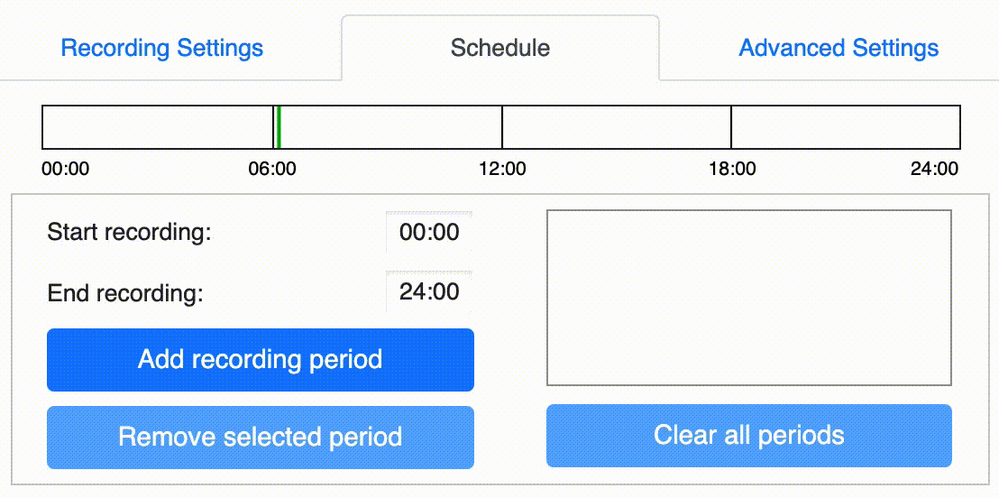

[](https://doi.org/10.5281/zenodo.4976243)

# AudioMoth: una guía práctica de la ARU de código abierto
por [Tessa Rhinehart](https://tessarhinehart.com), [Kitzes Lab](https://kitzeslab.org/), University of Pittsburgh

Publicado originalmente en 2019. Revisado en junio de 2021.

### Acerca de

Este documento pretende ser una guía completa tanto para usuarios nuevos de AudioMoth como para usuarios experimentados interesados en potenciar el despliegue de sus AudioMoths. Nuestro objetivo con esta guía es ayudarle a ganar intuición en el uso de AudioMoths; brindar consejos y recursos que hemos desarrollado durante el despliegue de miles de AudioMoths; y solucionar la amplia variedad de desafíos que puede encontrar durante el uso de estos dispositivos. 

Esta versión de la guía refleja el firmware más reciente disponible en el momento de la redacción (v.1.5.0); las versiones anteriores de la guía también están disponibles en [GitHub](https://github.com/rhine3/audiomoth-guide).

### Otras guías y soporte

La información en esta guía complementa la documentación oficial de [Open Acoustic Devices](https://www.openacousticdevices.info/getting-started) y una guía de [David Brown](https://sites.google.com/view/audiomoth/home). Desde la publicación original de esta guía en 2019, Open Acoustic Devices publicó un manual oficial similar a esta guía [en su sitio web](https://www.openacousticdevices.info/open-source). Estos documentos contienen información similar. La guía a continuación también provee información adicional sobre el uso práctico de AudioMoths, incluidas las opciones de alojamiento, procedimientos y protocolos de implementación, pruebas acústicas, obstáculos comunes y otras reglas generales para scaling up.

Si tiene alguna pregunta o comentario que no encuentre en ninguna de estas guías, hay varios foros disponibles para ayudarle. Intente buscar o publicar en los siguientes foros:

* [AudioMoth support forum](https://www.openacousticdevices.info/support) para preguntas específicas sobre AudioMoth
* [WILDLABS Acoustic Monitoring forum](https://www.wildlabs.net/community/group/acoustic-monitoring) para preguntas generales sobre bioacústica
* Comunidades de Twitter: utilice los hashtags #AudioMoth o #bioacoustics; siga a [OpenAcoustics](https://twitter.com/OpenAcoustics)

Por favor, envíe preguntas y sugerencias para modificar esta guía mediante la creación de “pull requests” en el repositorio de GitHub, o enviándome un correo electrónico a `tessa.rhinehart@pitt.edu`. Esta guía se publica bajo una licencia [CC-BY](https://creativecommons.org/licenses/by/4.0/), lo que significa que usted es libre de modificarla y redistribuirla para casi cualquier propósito con la debida [atribución](#citing-this-guide).

# Índice

Este documento contiene [enlaces a sitios web externos](https://www.openacousticdevices.com) y [enlaces internos](#tabla-de-contenidos).

* Inicio rápido](#quick-start)
* Suministros](#supplies)
  * Compra de AudioMoths](#compra-audiomoths)
  * [Tarjetas MicroSD](#microsd-cards)
  * baterías](#batteries)
* Firmware](#firmware)
* Crear configuración](#create-configuration)
  * Pestaña "Configuración de grabación" (#recording-settings-tab)
  * Pestaña "Programación" (#schedule-tab)
  * Pestaña "Configuración avanzada" (#advanced-settings-tab)
  * Ejemplos de configuración](#example-configurations)
* Establecer configuración y hora](#set-configuration-and-time)
  * Guardar y abrir configuraciones](#save-and-open-configurations)
  * Aplicar la configuración](#apply-configuration)
  * Establecer la hora](#set-the-time)
  * CONFIG.txt](#configtxt)
* Grabación](#recording)
  * Encender la grabadora](#switch-on-the-recorder)
  * [Solución de problemas de grabación](#recording-troubleshooting)
  * [¿Cuántas horas grabará mi AudioMoth?](#how-many-hours-will-my-audiomoth-record)
  * Calidad de grabación y calibración](#recording-quality-and-calibration)
* [Carcasas](#enclosures)
  * Bolsas de plástico](#plastic-bags)
  * Bolsas termoselladas](#heat-sealed-bags)
  * Carcasas rígidas](#hard-enclosures)
  * Camuflaje](#camouflage)
* Despliegue](#despliegue)
  * Selección de posiciones de despliegue](#select-deployment-positions)
  * Metadatos de despliegue](#deployment-metadata)
  * Protocolos de despliegue escritos](#written-deployment-protocols)
  * Ayudas electrónicas sobre despliegue](#electronic-deployment-aids)
  * Informar al público](#informing-the-public)
  * Otros consejos](#other-tips)
* Gestión de datos](#data-management)
  * Carga de datos](#data-upload)
  * Gestión de metadatos](#metadata-management)
* Análisis de datos](#data-analysis)
* Citar esta guía](#citing-this-guide)
* Agradecimientos](#acknowledgements)


# Inicio rápido

Utilizar AudioMoths es un proceso bastante sencillo. Una buena introducción general sobre el uso de AudioMoths está disponible en la página de Open Acoustic Devices ["Getting Started"](https://www.openacousticdevices.info/getting-started). A grandes rasgos, el uso de AudioMoths implica:

* Comprar [AudioMoths](#comprar-audiomoths), [tarjetas microSD](#tarjetas-microSD) y [baterías](#baterías).
* Insertar las baterías y la tarjeta microSD en la AudioMoth
* Descargar la [aplicación de configuración](https://www.openacousticdevices.info/applications) en su computador.
* Utilizar la aplicación para [crear un programa de grabación](#configuration-app) que la AudioMoth grabe.
* Conectar la AudioMoth al computador para configurar el reloj y aplicar la configuración.
* Cambiar el interruptor a "PERSONALIZADO" para comenzar a grabar según lo programado.
* Crear o comprar [carcasas](#carcasas) impermeables para sus AudioMoths
* Dejar las AudioMoths para grabar en el campo
* Recoger las AudioMoths
* Descargar los datos (#data-management) de las tarjetas microSD al computador.
* Revisar manualmente o utilizar programas automatizados para [analizar los datos](#data-analysis)

# Suministros

El primer paso para el montaje de una AudioMoth es conseguir los suministros necesarios y ensamblarlos para crear una grabadora que funcione.

## Comprar AudioMoths

Hay varias maneras de comprar AudioMoths. 

Dondequiera que compre AudioMoths, asegúrese de comprobar qué versión está comprando. Por ejemplo, AudioMoth v1.0.0 tiene esquinas afiladas y un interruptor que sobresale; v1.1.0 tiene esquinas redondeadas y un interruptor empotrado para reducir la rotura de la bolsa.

**Opción 1: GroupGets**: Las compras en grupo [GroupGets](https://groupgets.com/manufacturers/open-acoustic-devices/products/audiomoth) son la principal forma de adquirir la última versión de AudioMoths. Estas compras están disponibles periódicamente. Asegúrese de comprar sus AudioMoths con mucha antelación a su estudio, ya que estas compras no siempre están disponibles, y el plazo de fabricación de las AudioMoths puede ser de varios meses.

**Opción 2: LabMaker**: Para aquellos que no pueden esperar a la próxima compra de GroupGets, AudioMoth está disponible a precios más altos en LabMaker. Actualmente las versiones de AudioMoth disponibles en LabMaker son [AudioMoth v1.2.0](https://www.labmaker.org/products/audiomoth-v1-2-0) y [AudioMoth v1.1.0](https://www.labmaker.org/products/audiomoth-v1-1-0). Los precios de LabMaker son más elevados porque se ensambla un menor número de dispositivos a la vez, por lo que hay menos economía de gran escala.

**Opción 3: fabricación de PCB a gran escala**: Para algunas versiones de la AudioMoth, puede ser posible conseguir AudioMoths a un precio más bajo y en mayores volúmenes si realiza un pedido grande directamente a través de un fabricante de PCB.

* El fabricante de PCBs creará las AudioMoths basándose en el esquema que usted le proporcione. El esquema de las versiones anteriores de AudioMoths (1.0.0 y 1.1.0) se ha hecho público. El esquema de la versión 1.2.0 no se ha publicado, por lo que esta versión no se puede comprar actualmente a través de este método. 
* Nuestro laboratorio ha tenido excelentes experiencias comprando a [RushPCB](https://rushpcb.com/). Compramos los dispositivos pre-ensamblados (es decir, componentes conectados a las placas, batería soldada a la placa), pero sin el firmware flasheado. Nos resultó fácil flashear el firmware en nuestro laboratorio.
* Las piezas del diseño original de AudioMoth se agotan constantemente debido a la gran demanda. Como alternativa, recurrimos a la ayuda de la tienda de electrónica de nuestra universidad para así encontrar nuevas piezas que fueran intercambiables con las piezas agotadas y sustituirlas en el esquema.

## Tarjetas MicroSD

El AudioMoth guarda las grabaciones en una tarjeta microSD. 

### Elegir una tarjeta

La elección de la tarjeta dependerá principalmente de la frecuencia a la cual piense grabar.

Para grabar a frecuencias de muestreo de 48 kHz o inferiores, solemos utilizar tarjetas microSD SanDisk Ultra de 64 GB. Hemos comprobado que si se utiliza una tarjeta de 64 GB y se graba a una frecuencia de muestreo de 32 kHz, el almacenamiento de AudioMoths y la duración de la batería se agotan aproximadamente al mismo tiempo.

Para grabar a frecuencias de muestreo superiores a 48 kHz, utilizamos tarjetas microSD SanDisk Extreme de 128 GB. Estas frecuencias de muestreo requieren tarjetas SD con velocidades de lectura/escritura rápidas. Los archivos producidos con altas frecuencias de muestreo también son más grandes, por lo que consumen espacio en la tarjeta SD más rápidamente.  

Para más detalles sobre la selección de tarjetas microSD, consulte la [Guía de tarjetas SD] de Open Acoustic Devices (https://www.openacousticdevices.info/sd-card-guide).

### Nombre y formateo de la tarjeta

Es posible que desee nombrar o numerar sus tarjetas para organizar sus datos. Esto es especialmente útil para la organización durante la [carga de datos](#carga de datos). Para ello, conecte la tarjeta al computador y cámbiele el nombre. Esto también se puede conseguir al reformatear las tarjetas.

Las tarjetas microSD se suministran con uno de los dos sistemas de archivos siguientes: exFAT (para tarjetas de más de 32 GB) y FAT32 (para tarjetas de 32 GB o menos). Las versiones de firmware 1.2.2 y posteriores de AudioMoth pueden manejar cualquiera de estos formatos. Sin embargo, las versiones de firmware 1.2.1 y anteriores sólo admiten tarjetas FAT32. 

En cualquier caso, puede que desee reformatear sus tarjetas cada vez que las utilice, para asegurarse de que la tarjeta no tenga datos remanentes en ella (ver "Uso de la tarjeta" más abajo).

Si desea utilizar una versión del firmware de la AudioMoth anterior a la 1.2.2, deberá reformatear sus tarjetas al sistema de archivos FAT32. Los computadores Windows no pueden formatear de forma nativa tarjetas de más de 32 GB al formato FAT32, pero existen [programas gratuitos](http://ridgecrop.co.uk/index.htm?guiformat.htm) que permiten a los usuarios de Windows formatear tarjetas más grandes. Los computadores Mac pueden formatear tarjetas de al menos 128 GB; no hemos probado nada más grande.

### Uso de la tarjeta

Inserte la tarjeta en el AudioMoth con los contactos hacia **arriba**, como se muestra en el gráfico de la parte frontal del AudioMoth. (No encajará de otra forma).


Cuando una tarjeta SD se llena, la unidad dejará de guardar grabaciones en ella, y la luz LED roja de la unidad permanecerá encendida constantemente hasta que se extraiga la tarjeta SD.

Cuando reutilice una tarjeta microSD que ya ha sido desplegada, compruebe que la tarjeta está realmente vacía antes de reutilizarla:

* En computadores Mac, puede comprobar la cantidad de espacio restante en la tarjeta mediante la Utilidad de Discos. Eliminar archivos de la tarjeta microSD mediante la interfaz gráfica de usuario no los elimina realmente hasta que se vacía la papelera.
* Puede asegurarse de que una tarjeta está vacía reformateándola cada vez que la reutilice, o utilizando el comando `rm` en el terminal.


## baterías

### Elegir las baterías
La duración de las baterías depende del tipo de batería que utilice. Compruebe la capacidad de la batería en miliamperios-hora (mAh). 

* Las baterías AA de litio tienen mayor capacidad que las típicas baterías AA alcalinas, pero también cuestan más. 
* En la AudioMoth, las baterías están conectadas en serie, por lo que sus capacidades no se suman: la capacidad de las tres baterías conectadas en serie es igual a la capacidad de una sola batería.

### Aumentar la duración de la batería
Con algunos conocimientos de electrónica, puede conectar diferentes baterías a la grabadora para incrementar su duración. 

* El banco de baterías modificado debe tener una mayor capacidad manteniendo el mismo voltaje. Por ejemplo, 3 baterías D tienen el mismo voltaje que 3 baterías AA, pero tienen mayor capacidad, por lo que durarán más.
* El voltaje de las baterías conectadas en serie (como lo están en la AudioMoth) es igual al número de baterías multiplicado por el voltaje de cada batería. La AudioMoth v1.0 utiliza 3 baterías a 1,5 voltios cada una, por lo que el voltaje del banco de baterías es 3 * 1,5V = 4,5V.
* La capacidad de las baterías en serie es la capacidad de cualquiera de ellas. (No combine baterías de diferentes capacidades, o baterías nuevas y viejas ). Por ejemplo, una batería alcalina Duracell AA tiene una capacidad de 2850 mAh.

### Uso de las baterías
Debido a que la AudioMoth no tiene una batería incorporada, el tiempo programado se perderá si se cambia una batería o se sacude. En los firmwares de AudioMoth anteriores a 1.5.0, también se perderá el horario de grabación. Algunas sugerencias para solucionar este problema son:

* Si va a cambiar las baterías de su AudioMoth, utilice una de las aplicaciones de ajuste de hora (#set-the-time) para reajustar la hora.
* Tenga cuidado de no dejar caer o sacudir las AudioMoths durante su transporte. Reduzca la posibilidad de que las baterías se sacudan colocando cinta adhesiva de pintor en la parte trasera de la AudioMoth.
* Al desplegar las grabadoras en modo CUSTOM, será obvio si se ha desconfigurado la hora en un dispositivo; el LED rojo permanecerá encendido constantemente mientras que el LED verde parpadeará cuando intente cambiar el interruptor a CUSTOM.
* Lleve extra AudioMoths programadas durante los despliegues, por si se cae una y se le caen las baterías.

### Indicación del nivel de batería

Cuando la AudioMoth pasa del modo DEFAULT o CUSTOM al modo USB/OFF, el LED rojo parpadeará un número de veces correspondiente al nivel de batería. Hay dos escalas, una para uso con baterías alcalinas (por defecto) y otra para uso con baterías NiMH y LiPo. Esta última escala se puede utilizar seleccionando la opción "Utilizar el rango de voltaje NiMH/LiPo para indicar el nivel de batería" en la pestaña ["Configuración avanzada"](#advanced-settings-tab) de la aplicación AudioMoth-Config. Puede desactivar esta función en la aplicación.

En la escala estándar, más parpadeos indican un nivel de batería más alto, excepto cuando el voltaje de la batería es muy bajo. Los niveles de batería son:

* 4 parpadeos: >= 4.6 V
* 3 parpadeos: 4.4-4.5 V
* 2 parpadeos: 4.0-4.3 V
* 1 parpadeo: 3,6-3,9 V
* 10 parpadeos rápidos: <= 3,5 V; voltaje de la batería demasiado bajo para grabar con seguridad.

En la escala NiMH/LiPo, más parapadeos indican un nivel de batería más bajo:

* 1 parpadeo: >= 4.3 V
* 2 destellos: 4.2 V
* 3 parpadeos: 4.1 V
* 4 parpadeos: 4.0 V
* 5 parpadeos: 3.9 V
* 6 parpadeos: 3.8 V
* 7 parpadeos: 3.7 V
* 8 parpadeos: 3.6 V
* 10 parpadeos rápidos: <= 3,5 V; voltaje de la batería demasiado bajo para grabar con seguridad.

# Firmware

Como se ha discutido anteriormente, se han creado y publicado varias versiones diferentes de firmware para la AudioMoth. Estos firmwares suelen corregir errores e introducir nuevas funciones: por ejemplo, la versión 1.4.0 permitía a los usuarios activar la grabación de la AudioMoth sólo cuando el sonido supera un umbral de amplitud. El funcionamiento de la AudioMoth en las distintas versiones de firmware difiere ligeramente pero de forma significativa. Para ver todas las funciones añadidas o modificadas en cada versión del firmware, consulte [las descripciones de las versiones en el repositorio de GitHub](https://github.com/OpenAcousticDevices/AudioMoth-Firmware-Basic/releases). Usted mismo puede modificar el firmware y aplicar un firmware personalizado a su AudioMoth.

Si quiere flashear un nuevo firmware en su dispositivo, descargue la aplicación [aquí](https://www.openacousticdevices.info/flashing). Esta aplicación le permite descargar y aplicar cualquiera de las versiones de firmware estándar publicadas por Open Acoustic Devices (en la pestaña "Usar versión estándar"). Si desea personalizar el firmware de la AudioMoth, puede utilizar la aplicación de flasheo para aplicar un firmware personalizado a la AudioMoth (en la pestaña "Utilizar archivo local").

Si tiene problemas al flashear su AudioMoth, puede ser útil utilizar un clip para reiniciar su AudioMoth. Mientras la AudioMoth está conectada al computador en modo USB/OFF con las baterías quitadas, presione un clip en los dos pines metálicos de la placa de la AudioMoth que están etiquetados como "PROG". El clip debe alinearse con el gráfico blanco impreso debajo de la etiqueta "PROG".

# Crear la configuración

Antes de utilizar la AudioMoth, normalmente querrá crear una configuración de grabación personalizada. Esto implica crear una configuración utilizando la aplicación AudioMoth-Config. A continuación le ofrecemos algunos ejemplos de configuraciones. Puede guardar las configuraciones en archivos independientes y volver a cargarlas desde la aplicación. Una vez creada la configuración, conecte la AudioMoth al computador para aplicarla y ajustar la hora en la AudioMoth.

Dependiendo de sus necesidades, puede personalizar la hora del día en la que se realizan las grabaciones, la duración de cada grabación, el tiempo que la grabadora "duerme" entre cada grabación, etc. En general, las AudioMoths que están grabando según una configuración pasan por fases de grabación/reposo dentro de "periodos de grabación" que ya haya configurado. Por ejemplo, puede configurar la AudioMoth para que grabe un archivo de un minuto de duración cada 10 minutos durante las primeras 6 horas tras la puesta de sol. (Pero vea la información sobre el [modo por defecto](#default) más abajo, que hace que la AudioMoth empiece a grabar inmediatamente).

Descargue la [aplicación de configuración de Audiomoth](https://www.openacousticdevices.info/applications) en su computador para crear una configuración de grabación personalizada para su AudioMoth. La última versión de la aplicación de configuración tiene tres pestañas para controlar diferentes aspectos de la configuración de la grabadora: Ajustes de grabación, Programación y Ajustes avanzados. 

Para una introducción gráfica sencilla e intuitiva a este proceso, consulte la [Guía de la aplicación Open Acoustic Devices Config](https://www.openacousticdevices.info/config-app-guide). La siguiente descripción incluye algunos detalles adicionales.

## Pestaña "Ajustes de grabación”
Esta pestaña controla la tasa de muestreo de las grabaciones, la ganancia que se utilizará en el micrófono, la duración y el intervalo entre grabaciones, y algunos otros ajustes.

### Tasa de muestreo
Ajuste la tasa de muestreo como el doble de la frecuencia más alta que quiera grabar.

* **¿Qué tasa de muestreo debo utilizar?** Debe utilizar una tasa de muestreo que sea 2 veces superior a la frecuencia más alta que quiera grabar. Esta frecuencia de muestreo se conoce como [tasa de Nyquist](https://en.wikipedia.org/wiki/Nyquist_rate) y es la tasa de muestreo mínima necesaria para resolver un sonido a una frecuencia determinada. Para las aves, una tasa de muestreo de 32 kHz está bien. Para los llamados ultrasónicos de los murciélagos, se requiere una tasa de muestreo mucho mayor.

* Las tasas de muestreo superiores a 192 kHz son "experimentales": Uselas con precaución.

* Grabar a altas tasas de muestreo requiere tarjetas SD más rápidas y ocupa más espacio de almacenamiento. Vea la sección sobre [Tarjetas SD](#tarjetas-sd-y-baterías) para más información. 

* ¿Qué es una tasa de muestreo? Un micrófono captura audio transformando las ondas sonoras en voltaje. El audio digital se graba muestreando ese voltaje. La *tasa de muestreo* en Hz es el número de veces por segundo que se muestrea el voltaje. Para una introducción útil al audio digital, consulte [esta guía](https://web.archive.org/web/20190201094638/https://docs.cycling74.com/max5/tutorials/msp-tut/mspdigitalaudio.html)

### Ganancia
La ganancia es la cantidad que se amplificarán los sonidos del micrófono una vez grabados. Seleccionar la ganancia óptima requiere prueba y error en sus condiciones de campo particulares. Si la ganancia es demasiado alta, sus grabaciones se [recortarán](https://en.wikipedia.org/wiki/Clipping_(audio)), creando una distorsión desagradable que puede ser difícil, si no imposible, de analizar. Por el contrario, si la ganancia es demasiado baja, los sonidos serán débiles y difíciles de oír.

### Ciclos de grabación/reposo
En la pestaña "Programación" se selecciona la hora del día a la que la AudioMoth debe grabar cada día (el "periodo de grabación" o periodos). Sin embargo, la AudioMoth no tiene que grabar continuamente dentro de ese periodo de tiempo. Puede utilizar un horario de grabación/reposo para grabar sólo una cantidad limitada de tiempo durante el periodo de grabación programado.

* Cuando esta función está activada, la grabadora creará una grabación durante el número de segundos indicado en "duración de la grabación" y luego dormirá durante el número de segundos indicado en "duración del reposo."

* Si no desea activar esta función, desactive "Activar grabación cíclica de reposo/grabación".
  
* Con versiones anteriores del firmware (<1.4.0), para hacer un único archivo continuo cada periodo de grabación, no es posible desactivar esta función manualmente. En su lugar, debe ajustar la duración de la grabación igual a la duración del periodo de grabación más largo. 
  
* Con versiones anteriores del firmware (<1.4.2), debe asegurarse de que el tamaño de sus archivos es inferior al límite de tamaño de archivo WAV de 4,3 GB (4000 MB).

* Incluso si el periodo de reposo está ajustado a 0, el dispositivo dormirá brevemente entre grabaciones para terminar de guardar la grabación anterior en la tarjeta.

### Habilitar LED
Esta característica le permite encender las luces LED para obtener más información acerca de su AudioMoth, aunque esto podría atraer la atención de animales / humanos curiosos. Las luces son especialmente útiles cuando se prueba la grabadora. 

En general, cuando la AudioMoth está en modo CUSTOM o DEFAULT, un LED rojo significa que la AudioMoth está grabando, un LED verde significa que la AudioMoth está durmiendo entre grabaciones, y LEDs rojos y verdes simultáneos significan que la grabación de la AudioMoth ha fallado o fallará de alguna manera. Los fallos son de dos tipos:

1. LED rojo constantemente encendido, LED verde parpadeante: la AudioMoth tiene una configuración, pero la hora no está ajustada. 
   * Esto puede ser causado por la pérdida de energía de la batería o por configurar la AudioMoth con la opción "Requerir siempre timbre acústico al cambiar a CUSTOM"."
   * Esto puede solucionarse configurando la hora mediante las aplicaciones del computador o del teléfono (consulte la información sobre cómo [configurar la hora](#configurar-la-hora)).
2. LED rojo parpadeante, LED verde parpadeante: el "doble parpadeo" significa que la AudioMoth ha encontrado un error de grabación. Esto ocurre en tres circunstancias:
   * 100ms de parpadeo al cambiar por primera vez al modo CUSTOM: no se ha establecido ninguna programación de grabación. En versiones de firmware anteriores, esto ocurría si la AudioMoth perdía su configuración al quedarse sin baterías; ahora, la AudioMoth mantiene su configuración aunque se quede sin baterías.
   * 500ms de parpadeo: hay un error de grabación actual debido a un mal funcionamiento de la grabadora (por ejemplo, si se moja), a que la tarjeta SD funciona mal, está llena o no se ha formateado correctamente, o a que la batería está baja. Esto ocurre en el modo CUSTOM cuando la grabadora está intentando grabar, o en el modo DEFAULT.
   * 10ms de parpadeo: se ha producido un error de grabación en una grabación anterior. Esto ocurre cuando la AudioMoth está programada para dormir en modo CUSTOM.

El LED también funciona para:

* Mostrar el progreso del timbre acústico (ver información sobre las [aplicaciones de timesetter](#set-time-with-mobile-apps))
* Mostrar el nivel de batería (ver información sobre [indicación del nivel de batería](#indicación-del-nivel-de-batería))

Para obtener información completa y diagramas de los significados de los LED, consulte [esta página web](https://www.openacousticdevices.info/led-guide)

### Activar desconexión por bajo voltaje

Cuando el voltaje de la batería es demasiado bajo, el ingreso de información en la tarjeta microSD puede ser inconsistente o poco fiable. Esta opción hace que la AudioMoth deje de grabar cuando el voltaje de la batería es demasiado bajo para un ingreso de información fiable.

### Activar indicación de nivel de batería

Cuando esta opción está marcada, la AudioMoth indica su nivel de batería con LEDs cuando se cambia al modo USB/OFF desde el modo CUSTOM o el modo DEFAULT. Para obtener información sobre el significado de estos parpadeos, consulte la sección [indicación del nivel de batería](#indicacióndelniveldela batería). Si utiliza baterías recargables, en la pestaña "Ajustes avanzados" existe la opción de utilizar una indicación más precisa del nivel de carga de las baterías.

## Pestaña "Programación”

La pestaña "Programación" le permite establecer de 1 a 4 periodos de grabación en Tiempo Universal Coordinado (UTC por sus siglas en inglés) o en su zona horaria local utilizando un reloj de 24 horas. 

# ADVERTENCIA: ¡COMPRUEBE SI ESTÁ CREANDO SU PROGRAMACIÓN DE GRABACIÓN EN UTC O EN SU PROPIA ZONA HORARIA! (ver más abajo)

Esperamos que esta advertencia llame la atención de cualquiera que hojee rápidamente esta guía. Este es uno de los errores silenciosos más frecuentes al utilizar una AudioMoth. 

Siga cuidadosamente las instrucciones de la siguiente sección, o de lo contrario puede que programe sus AudioMoths para grabar a la hora equivocada. Es decepcionante traer sus grabadoras de vuelta después de 2 meses de despliegue y darse cuenta de que sus grabaciones del "coro del amanecer" fueron tomadas en realidad a medianoche.

### UTC vs. hora local
En lugar de referirse a una zona horaria (como “Eastern Time”, “Pacific Time”, etc.) las grabaciones en AudioMoth se programan por defecto en UTC.

**¿Qué es UTC?**: UTC es un estándar de tiempo universal que se utiliza para evitar la ambigüedad en las zonas horarias. UTC es equivalente a la hora del meridiano de Greenwich (GMT por sus siglas en inglés), pero no tiene en cuenta el horario de verano (“Daylight savings”) como hacen algunos países de la zona horaria GMT.

**¿Puedo programar AudioMoths en hora local?**: Sí, puede utilizar la hora local en lugar de la UTC para programar sus dispositivos. Para ello, haga clic en el menú principal del programa ("Archivo" en la parte superior izquierda de la aplicación en computadores Windows; "AudioMoth-Config" en la parte superior de la pantalla en computadores Mac). Allí puede cambiar el ajuste "Hora local". 

**¿Cuándo debo utilizar la hora local? algunos ejemplos de factores a tener en cuenta:

* ¿Usted o sus colaboradores utilizarán sus grabadoras en varias zonas horarias?
* ¿Trabajan usted o sus colaboradores en una zona horaria distinta a la de sus grabadoras? 
* ¿Sus colaboradores esperan ver las grabaciones en una zona horaria determinada?
* ¿Va a crear el archivo de grabación en una zona horaria diferente a la que se aplicará el archivo de grabación a la AudioMoth?

Como nuestro laboratorio trabaja en varias zonas horarias y el uso de la hora local introduce ambigüedad, sólo programamos nuestras grabadoras en UTC. Sin embargo, a veces activamos la opción "hora local" para comprobar que hemos calculado correctamente la hora en UTC. Puede activar la hora local para comprobarlo y desactivarla de nuevo antes de aplicarla a una grabadora.

Tenga en cuenta que cuando se crea una grabación en hora local, aunque el nombre del archivo esté en hora local, la hora UTC en la que se creó se sigue guardando en los [metadatos](#metadatos) de cada grabación.

### Periodos de grabación

Son las horas en las que la AudioMoth grabará cada día. Los periodos de grabación sólo se usarán cuando la AudioMoth esté en modo CUSTOM. En modo DEFAULT, la grabadora comienza a grabar inmediatamente, sin tener en cuenta los periodos de grabación programados. 

Duración de las grabaciones:

* Por defecto, la AudioMoth realizará una grabación larga para cada periodo individual. 
* Puede especificar una duración de grabación más corta si activa la grabación cíclica en reposo/grabación.
* Las grabaciones se dividirán si el periodo de grabación es tan largo que el tamaño de los archivos WAV supera el tamaño máximo que se puede guardar en la tarjeta microSD.

Creación de periodos de grabación:

* Introduzca la hora de inicio y fin del periodo en **la zona horaria correcta ([UTC u hora local](#utc-vs-local-time))**.
* Pulse "Añadir periodo de grabación" después de introducir la hora deseada de inicio y fin de cada periodo de grabación.
* Los periodos de grabación aparecerán en el gráfico rojo/blanco y en el listado de periodos a la derecha del programa.
* Elimine los periodos no deseados haciendo clic en el periodo en el gráfico o en el listado de periodos de la parte derecha del programa y haciendo clic en "Eliminar periodo seleccionado".
* Borre todos los periodos de grabación haciendo clic en el botón "Borrar todos los periodos".

La siguiente animación ilustra los pasos anteriores (no aparece en versión PDF):



### Seleccionar la primera y la última fecha de grabación
Por defecto, la AudioMoth empieza a seguir inmediatamente su programación de grabación cuando se pone en modo CUSTOM. Cuando estas funciones están activadas, la AudioMoth en modo CUSTOM empezará a seguir el horario el día que usted especifique y dejará de grabar el día que usted especifique. 

Esto es útil si desea desplegar sus grabadoras antes de las fechas de estudio deseadas (por ejemplo, si su sitio es inaccesible en esas fechas, o si tiene muchas grabadoras para desplegar y quiere que empiecen a grabar simultáneamente).

## Pestaña "Ajustes avanzados

Las dos primeras características se pueden utilizar por separado, o combinadas para crear una "grabación activada por amplitud de banda", muy popular para capturar vocalizaciones de murciélagos. Para más información sobre estas funciones, consulte [este documento](https://github.com/OpenAcousticDevices/Application-Notes/blob/master/Using_AudioMoth_with_Filtering_and_Amplitude_Threshold_Recording.pdf)

### Filtro
Esta función le permite grabar sólo datos de una banda de frecuencia determinada. Cuando activa el filtro puede elegir los siguientes filtros. Cada uno de ellos le permite seleccionar las frecuencias que desea incluir en la grabación. El resto de frecuencias se filtrarán.

* Paso bajo (Low-pass): filtra las frecuencias altas.
* Paso banda (Band-pass): filtra tanto las frecuencias altas como las bajas.
* Paso alto (High-pass): filtra las frecuencias bajas

### Umbral de amplitud
Esta función hace que AudioMoth sólo guarde segmentos de audio en el archivo cuando contengan una muestra que supere un determinado umbral de amplitud. Esto le permite ahorrar en almacenamiento al no guardar archivos vacíos--especialmente útil para archivos de alta tasa de muestreo, que son muy grandes. 

La AudioMoth sigue grabando según lo programado durante este modo, pero sólo guarda un archivo en la tarjeta microSD cuando se alcanza el umbral de amplitud. La duración y programación originales de estas grabaciones se pueden restaurar utilizando la opción "Expandir grabaciones de la AudioMoth" en el [menú principal del programa](#menú-principal-del-programa).

Este método está pensado principalmente para animales que llaman a altas frecuencias; las grabaciones de alta tasa de muestreo necesarias para capturar las llamadas de estos animales ocupan mucho espacio de almacenamiento. No recomendamos usar este método para animales que llaman a frecuencias audibles, donde hay mucho ruido que podría causar falsas activaciones. Además, tenga en cuenta que el uso de activación basada en umbral de amplitud limita la aplicabilidad de sus grabaciones a otros taxa.

### Requerir siempre timbre acústico

Esta opción significa que se requiere un timbre acústico desde una aplicación de teléfono para iniciar la grabación de la AudioMoth cada vez que se cambia inicialmente al modo CUSTOM. Con esta opción activada, al pasar por primera vez al modo CUSTOM, la AudioMoth actuará como si no tuviera configuración de hora, incluso si no ha perdido la hora: su LED rojo se encenderá constantemente, su LED verde parpadeará y no empezará a grabar a la hora programada. Al tocar el timbre acústico, la AudioMoth saldrá de este modo y comenzará a grabar según el horario configurado. 

Este ajuste puede ser útil cuando se utiliza la aplicación RFCx. Su timbre también proporciona a la grabadora un ID de despliegue único que se incluirá en los [metadatos](#metadata) de cada grabación. Este ID de despliegue también puede asociarse a una ubicación en la aplicación. Al requerir un timbre, debe recordar usar la app para configurar el ID de despliegue cada vez.

### Utilizar el rango de voltaje NiMH/LiPo para la indicación del nivel de batería

Si está utilizando baterías recargables (NiMH/LiPo), marcar esta casilla cambiará el significado del número de parpadeos de LED utilizados en [indicación de nivel de batería](#indicación-nivel-de-batería). Esta escala es aparentemente más precisa.


## Menú principal del programa

Algunas opciones adicionales están disponibles en el menú principal del programa. Para acceder a este menú, haga clic en "Archivo" en la parte superior izquierda de la aplicación en computadores Windows; o haga clic en "AudioMoth-Config" en la parte superior de la pantalla en computadores Mac. 

* **Abrir configuración**/**Guardar configuración**: guardar o abrir un archivo de configuración guardado (ver [más abajo](#guardar-y-abrir-configuraciones))
* **Copiar ID de dispositivo**: cada dispositivo tiene un ID de hardware único. Cuando se conecta el dispositivo, esta opción de menú copia el ID único del dispositivo. El ID del dispositivo se guarda en los metadatos de cada grabación que realiza el dispositivo, por lo que puede ser una forma útil de comprobar dónde se realizó una grabación.
**Hora local**: programar la AudioMoth para que tome la hora local y guarde las grabaciones en dicha hora. Para más información, consulte la sección sobre [UTC vs. hora local](#utc-vs-local-time)
* **Expand AudioMoth recordings**: este ajuste expande las grabaciones realizadas cuando un AudioMoth utiliza [amplitude threshold recording](#amplitude-threshold) para restaurar la duración de grabación original y los tiempos relativos. Sólo se aplica a las grabaciones con el sufijo "T.WAV".

## Ejemplos de configuración

A continuación encontrará enlaces a dos ejemplos de archivos de configuración. Los archivos de configuración se componen de texto estructurado que puede visualizarse en un editor de texto. El contenido del archivo de configuración también se muestra debajo de la configuración. 

**Ejemplos de configuración del coro del amanecer **: Esta configuración, [example_bird_config.config](documents/example_bird_config.config), crea una única grabación diaria de 3 horas de duración entre las 08:30 UTC (`"startMins":510` = 510 minutos después de medianoche) y las 11:30UTC (`"endMins":690` = 690 minutos después de medianoche). La AudioMoth está programada para comenzar a grabar el 10 de mayo de 2021 y finalizar la grabación el 10 de julio de 2021. La tasa de muestreo de la grabadora está configurada a 32 kHz, lo que significa que grabará sonidos de hasta 16 kHz. Esta configuración sería adecuada para captar el coro del amanecer en gran parte del noreste de Estados Unidos. 

Si decide utilizar este archivo como plantilla para su propia grabación, asegúrese de cambiar la primera y la última fecha de grabación.

```
{
"timePeriods": [{"startMins":510,"endMins":690}],
"ledEnabled": true,
"lowVoltageCutoffEnabled": true,
"batteryLevelCheckEnabled": true,
"sampleRate": 32000,
"gain": 2,
"recordDuration": 55,
"sleepDuration": 5,
"localTime": false,
"firstRecordingDate": "2021-05-10",
"lastRecordingDate": "2021-07-10",
"dutyEnabled": false,
"passFiltersEnabled": false,
"filterType": "band",
"lowerFilter": 6000,
"higherFilter": 16000,
"amplitudeThresholdingEnabled": false,
"amplitudeThreshold": 0,
"requireAcousticConfig": false,
"displayVoltageRange": false
}
```
Aunque esta configuración da valores para ciertos ajustes como la duracion de grabación y reposo para la grabación de ciclo de trabajo cíclico, y parámetros para un filtro de banda, estos ajustes están desactivados (`"dutyEnabled": false` y `"passFiltersEnabled": false`).

**Ejemplo de grabación de un murciélago**: Esta configuración, [example_bat_config.config](document/example_bat_config.config), está configurada para grabar entre las 03:00UTC y las 05:00UTC. Graba cíclicamente 55s encendido y 5s apagado. También incluye una combinación de un filtro de banda alta (High pass) de 50kHz y un umbral de amplitud a 512. El umbral de amplitud significa que sólo los segmentos de grabaciones que contengan una muestra superior a 512 se guardarán en la AudioMoth. Debido a que esta característica se combina con un filtro de banda alta que reduce el ruido en las frecuencias más bajas, el ruido fuerte en las frecuencias más bajas no provocará que la grabación se guarde en la tarjeta microSD. 

No hemos probado estos ajustes para el filtro de banda alta y las funciones de activación de amplitud; si decide utilizar este archivo como plantilla para su propia configuración, asegúrese de probar y ajustar los valores de estos ajustes para que funcionen en su propio caso, y de leer el [documento técnico de Open Acoustic Devices sobre esta función](https://github.com/OpenAcousticDevices/Application-Notes/blob/master/Using_AudioMoth_with_Filtering_and_Amplitude_Threshold_Recording.pdf).

```
{
"timePeriods": [{"startMins":180,"endMins":300}],
"ledEnabled": true,
"lowVoltageCutoffEnabled": true,
"batteryLevelCheckEnabled": true,
"sampleRate": 384000,
"gain": 2,
"recordDuration": 55,
"sleepDuration": 5,
"localTime": false,
"dutyEnabled": true,
"passFiltersEnabled": true,
"filterType": "high": alto,
"lowerFilter": 50000,
"higherFilter": 65535,
"amplitudeThresholdingEnabled": true,
"amplitudeThreshold": 512,
"requireAcousticConfig": false,
"displayVoltageRange": false
}
```

# Establecer configuración y Hora

## Guardar y abrir configuraciones

Puede guardar su horario de grabación completo como un archivo para consultarla más tarde, reutilizarla, copiarla y compartirla. Puede acceder a estas funciones a través del menú principal del programa ("Archivo" en la parte superior izquierda de la aplicación en computadores Windows; "AudioMoth-Config" en la parte superior de la pantalla en computadores Mac). 

Para guardar una configuración:

* Vaya al menú principal
* Haga clic en "Guardar configuración"
* Guárdela con un nombre descriptivo

Para abrir una configuración guardada: Hacer clic en un archivo .config en el explorador de archivos no abre el archivo en la app AudioMoth-Config. En su lugar, abra la programación guardada a través de la propia app de configuración.

* Vaya al menú principal
* Haga clic en "Abrir configuración".
* Navegue hasta su archivo .config y ábralo.

## Aplicar configuración

Después de crear su configuración, conecte la AudioMoth a su computador, y establezca la hora actual y el horario de grabación deseado a través de la interfaz de la app.

* Ponga el interruptor de la AudioMoth en modo USB/OFF.
* Conéctela al computador mediante un cable microUSB.
* Compruebe que la AudioMoth está conectada: la fecha, la hora y la información de la grabadora en la aplicación de programación cambiarán de color gris a negro.
* Pulse el botón verde "Configurar AudioMoth" en la aplicación de programación. Esto guarda el programa de grabación en la AudioMoth y ajusta el reloj interno de la AudioMoth.
* La hora que se mostrará depende de si está utilizando UTC o la hora local (ver [UTC vs. hora local](#utc-vs-local-time)).

La AudioMoth tiene ahora una configuración de grabación personalizada y puede desconectarla del computador. 

**¿Por qué mis AudioMoths cuentan desde las 00:00:00, 01/01/1970 UTC cuando las conecto por primera vez?**: 

* La medianoche del 1 de enero de 1970 se llama "época Unix". La mayoría de los sistemas operativos miden la hora y  fecha como una medida de cuánto tiempo ha transcurrido desde esta hora y fecha. 
* Cuando inserte las baterías por primera vez en la AudioMoth, empezará a contar desde esta hora y fecha, por lo que el tiempo que muestra la AudioMoth cuando está enchufada al computador es una medida del tiempo que las baterías han estado en su AudioMoth. Por lo tanto, normalmente no verá una hora de exactamente 00:00:00, pero en su lugar 
* Observe la hora cuando conecte su AudioMoth al computador por primera vez. Si la hora empieza a contar exactamente a partir de las 00:00:00, esto puede indicar que las baterías no estaban correctamente insertadas en la AudioMoth, y nunca empezó a marcar la hora. Desconecte su AudioMoth y compruebe las baterías.

En el firmware v1.5.0 y posteriores, aplicar la configuración a la AudioMoth una sola vez es suficiente para guardar esta configuración en la AudioMoth incluso si se cambian las baterías o se sacuden. 

## Ajustar la hora

La hora se ajusta automáticamente al establecer la configuración, a menos que seleccione la opción "Requerir siempre timbre acústico al cambiar a CUSTOM" en la pestaña "Ajustes avanzados" de la app de configuración. Si esta opción está seleccionada, o si la AudioMoth está configurada pero pierde la hora porque cambió las baterías o las sacudió, será necesario ajustar la hora en la AudioMoth. Si la AudioMoth está configurada pero es necesario ajustar la hora, los LEDs de la AudioMoth tendrán el siguiente patrón de parpadeo: LED rojo encendido constante; LED verde parpadeando rápidamente. 

Existen tres métodos para ajustar la hora.

### Ajustar la hora con aplicaciones de computador

Cualquier aplicación de computador puede utilizarse para ajustar la hora en una AudioMoth que haya perdido su hora. Sin embargo, si la AudioMoth se configuró con la opción "Requerir siempre timbre acústico al cambiar a CUSTOM", la AudioMoth requerirá la programación mediante un timbre acústico, incluso si ajusta la hora con cualquiera de estas apps de computador.

#### Aplicación AudioMoth-Config
Puede utilizar la app de configuración para reajustar la hora. Pero tenga cuidado: si su configuración de grabación deseada (horario, tasa de muestreo, etc.) no está cargada en la app config cuando intente reajustar la hora, ¡eliminará su configuración de su AudioMoth!

#### Aplicación AudioMoth-Time
Open Acoustic Devices ofrece una aplicación autónoma de ajuste de tiempo que puede utilizar en su computador ("AudioMoth Time App" en [esta página web](https://www.openacousticdevices.info/applications)) y le permite ajustar el tiempo sin tener cargada la configuración de grabación.

### Ajustar la hora con aplicaciones móviles

Puede ajustar la hora mediante dos aplicaciones para celulares o tablets que codifican la fecha y la hora en una señal acústica. Las AudioMoths se pueden programar de esta forma cuando entran en "modo acústico", un modo especial cuando el interruptor está en CUSTOM en el que el LED rojo está encendido constantemente y el LED verde parpadea. Hay tres formas de entrar en este modo:

* La AudioMoth está  en modo CUSTOM pero la hora no está ajustada, por ejemplo, debido a la pérdida de batería.
* La AudioMoth está en modo CUSTOM y se ha configurado con la opción "Requerir siempre timbre acústico al pasar a modo CUSTOM".
* Reproducir un tono específico (ver más abajo) al pasar la AudioMoth del modo USB/OFF al modo CUSTOM.

Le recomendamos que antes de confiar en una aplicación cuando esté en campo, la pruebe para asegurarse de que se comporta como usted espera, por ejemplo, programando su AudioMoth y conectándola después a su computador para comprobar la hora ajustada.

Existen dos aplicaciones para programar AudioMoths:

La [AudioMoth Mobile App](https://www.openacousticdevices.info/mobileapplications) está disponible para [Android](https://play.google.com/store/apps/details?id=info.openacousticdevices.audiomoth) y [iOS](https://apps.apple.com/us/app/audiomoth/id1530808973). 

* Sólo restablece la hora de las grabadoras que ya están en modo acústico; no puede poner una grabadora en modo acústico, por lo que no restablecerá la hora de ninguna grabadora programada previamente. 
* Puede forzar manualmente el modo acústico de una grabadora quitándole las baterías, haciendo que pierda la hora programada y, a continuación, cambiándola al modo personalizado.

La [RFCx Companion app](https://support.rfcx.org/article/65-using-the-companion-app) sólo está disponible para [Android](https://play.google.com/store/apps/details?id=org.rfcx.companion&hl=en_US&gl=US).

* Cambia las grabadoras al modo acústico emitiendo un tono a una frecuencia específica. Cuando cambie la AudioMoth del modo USB/OFF al modo CUSTOM mientras se reproduce este tono, la AudioMoth pasa al modo acústico. 
* Este timbre acústico también asigna un ID de despliegue único a la AudioMoth. Describimos brevemente esta y otras funciones de esta app [más abajo](#rfcx-companion-app).


## CONFIG.txt

En versiones posteriores del firmware (1.4.0 y posteriores), la información sobre el archivo de configuración se guarda en la tarjeta microSD de la AudioMoth en un archivo llamado CONFIG.txt. Esto permite un registro más sencillo. 

Este archivo se guarda en la tarjeta microSD cuando la AudioMoth está grabando en modo CUSTOM o DEFAULT. No se guarda nada en la tarjeta hasta que se enciende la AudioMoth.

He aquí un ejemplo de archivo CONFIG.txt:

```
ID del dispositivo : 247AA5015C02F90F
Firmware : AudioMoth-Firmware-Básico (1.5.0)

ID de despliegue: 94DB49FDC0B963A6

Zona horaria : UTC

Tasa de muestreo (Hz) : 48000
Ganancia : Media

Duración del reposo (s) : 5
Duración de grabación (s) : 55

Periodos de grabación activos : 1

Periodo de grabación 1 : 13:15 - 14:15 (UTC)

Hora de grabación más temprana : ---------- --:--:--
Última hora de grabación : ---------- --:--:--

Filtro : -
Umbral de amplitud : -
Duración mínima del umbral (s) : -

LED de activación : Sí
Habilitar corte por baja tensión : Sí
Activar indicación de nivel de batería : Sí

Requerir siempre timbre acústico : Sí
```

El archivo CONFIG.txt se sobrescribirá a medida que se realicen nuevas grabaciones -- por lo que si cambia el calendario de grabación de su AudioMoth pero no sustituye su tarjeta, tenga en cuenta que el archivo CONFIG.txt de la AudioMoth sólo hará referencia al calendario de grabación utilizado más recientemente.

La AudioMoth guarda los archivos CONFIG.txt incluso cuando la grabadora está en modo DEFAULT. La información en el CONFIG.txt sigue refiriéndose a los periodos de grabación y otros ajustes seleccionados en el programa personalizado aplicado a la AudioMoth, aunque en modo DEFAULT la AudioMoth comience a grabar sin tener en cuenta los periodos de grabación personalizados.


# Grabación

## Encender la grabadora

La AudioMoth tiene un interruptor en el dispositivo para acceder a sus tres modos: USB/OFF, DEFAULT y CUSTOM.

### USB/OFF
Este modo tiene dos funciones.

* USB: Cuando la AudioMoth está conectada al computador mediante USB. El interruptor también debe cambiarse a este modo cuando se conecta la AudioMoth al computador para aplicar un programa de grabación o actualizar el firmware (USB).
* OFF: Cuando no está conectada al computador, la grabadora está en un estado de bajo consumo, pero sigue manteniendo la hora.

### DEFAULT
El modo DEFAULT generalmente hace que la AudioMoth se encienda y comience a grabar inmediatamente. 

* El comportamiento en modo DEFAULT depende de la versión de firmware aplicada a la AudioMoth y de si la AudioMoth ha sido programada. 
* Firmware 1.4.2 y posteriores: Graba continuamente, ignorando los ajustes de reposo/duración.
  * Si la AudioMoth ha sido configurada, utiliza la misma tasa de muestreo y nivel de ganancia de la configuración
* Firmware < 1.4.2: Crea grabaciones con reposo intercalado
  * Si se ha configurado el horario de la AudioMoth, utiliza con los ajustes de reposo/duración de esa configuración
  * Si  AudioMoth schedule no lo está, graba durante 10 segundos encendido, 5 segundos apagado

### CUSTOM
Este es el modo utilizado para grabar según la configuración personalizada.
Tenga en cuenta que el interruptor es frágil y se rompe con facilidad. Un toque lento, cuidadoso y firme reduce los quiebres del interruptor al encender y apagar la AudioMoth. Si su interruptor se ha roto, es posible [reemplazar el deslizador del interruptor](https://www.openacousticdevices.info/support/device-support/simple-audiomoth-switch-repair).

La AudioMoth se puede encender de dos maneras: Modo DEFAULT (mover el interruptor a la derecha) o modo CUSTOM (mover el interruptor a la izquierda).

* **DEFAULT:** El dispositivo empieza a grabar inmediatamente. El periodo/calendario de grabación es irrelevante en el modo DEFAULT.

  * Con versiones de firmware anteriores a la 1.4.2, la AudioMoth realizará una grabación durante el tiempo deseado y, a continuación, reposará durante el tiempo deseado. El dispositivo repite este ciclo continuamente. Si la grabadora no se ha configurado con la aplicación de configuración, los ajustes de duración de reposo/grabación son, por defecto, 10 segundos de grabación - 5 segundos de reposo.

  * A partir de la versión de firmware 1.4.2, el modo DEFAULT graba continuamente, ignorando los ajustes de reposo/duración del tiempo de grabación. 

* **CUSTOM:** 

  * Si el dispositivo se enciende fuera de los períodos de grabación programados,el dispositivo espera hasta que comience el período de grabación y luego comienza su programa de grabación. 
  
  * Si se enciende durante el periodo de grabación, se comporta de forma diferente en función del firmware utilizado.
            * Con un firmware anterior a la versión 1.4.1, la AudioMoth no comenzará a grabar hasta que comience la siguiente grabación programada. Por ejemplo, considere una AudioMoth programada para grabar a las 09:00, con una duración de grabación de 2 minutos y una duración de reposo de 2 minutos. Si la AudioMoth se pusiera en modo CUSTOM a las 9:01, se saltaría la grabación programada para las 9:00-9:02, y esperaría hasta las 09:04 para realizar su primera grabación.
            * Con la versión de firmware 1.4.1 y superiores, la grabación se iniciará a mitad de ciclo, en lugar de esperar a que comience el siguiente ciclo.


## Resolución de problemas de grabación

* Si la tarjeta microSD de una unidad está llena, la unidad deja de guardar grabaciones. Así se evita sobrescribir grabaciones anteriores. En esta situación, la luz LED roja de la unidad permanecerá constantemente encendida hasta que se extraiga la tarjeta SD.

* Si apaga la AudioMoth mientras está grabando, se perderán algunos datos. Esto se debe a que la velocidad a la que se guardan los datos en la AudioMoth va por detrás del tiempo real. Hemos comprobado que apagar una grabadora mientras está grabando provoca una pérdida de datos de aproximadamente un 3%; por ejemplo, una grabación que se detuvo a la hora de iniciarse perderá 1,8 minutos (60 minutos * 0,03 = 1,8 minutos).

* Las primeras versiones del firmware de AudioMoth utilizan nombres de archivo con representaciones compactas de la fecha y hora en que comenzó la grabación. Estos nombres de archivo se pueden convertir en fecha y hora siguiendo las instrucciones del manual de usuario de AudioMoth o utilizando uno de los varios scripts, por ejemplo [`audiomoth-scripts` de Nathan Wolek](https://github.com/nwolek/audiomoth-scripts). Por el contrario, la hora de "última modificación" representa la hora en UTC en que se guardó el archivo, es decir, la hora en UTC en que finalizó la grabación. El firmware más reciente guarda nombres de archivo más fáciles de interpretar.

* La AudioMoth está en continuo desarrollo. Las nuevas versiones de firmware a veces cambian el comportamiento de la AudioMoth. Si su AudioMoth tiene un comportamiento inesperado, compruebe en las [notas de la versión](https://github.com/OpenAcousticDevices/AudioMoth-Firmware-Basic/releases) la versión del firmware con la que se fabricó su AudioMoth y utilice el foro de soporte de Open Acoustic Devices. (Una buena regla general es utilizar la misma versión del firmware para todas las AudioMoths en un despliegue).

* La deriva esperada de AudioMoth es de ~2s por día. Esto afecta la sincronización multidispositivo para aplicaciones como, por ejemplo, la localización. El uso de un dispositivo que produzca un sonido con distancia y hora del día conocida puede ser utilizado para una sincronización general.

* La corrosión alrededor de los terminales de la batería puede impedir que la AudioMoth grabe, o puede hacer que el voltaje de la batería parezca bajo cuando la AudioMoth está conectada a la aplicación de configuración, incluso si el dispositivo tiene baterías nuevas. El uso de un borrador de lápiz puede eliminar la corrosión de los terminales.

## ¿Cuántas horas grabará mi AudioMoth?

El número de horas que puede grabar una AudioMoth depende de una combinación de la capacidad de sus baterías, el tamaño de almacenamiento de su tarjeta microSD, la frecuencia de muestreo a la que está grabando y si está utilizando o no la grabación activada.

La aplicación de configuración de AudioMoth calculará la energía y el almacenamiento utilizados *por día* una vez que haya especificado el periodo de grabación y las duraciones de grabación/reposo. Esto aparece en la parte inferior de la aplicación de configuración en cada pestaña. La grabadora dejará de grabar cuando agote todo el almacenamiento de la tarjeta microSD o cuando se agote la batería: lo que ocurra primero.

* Para renovar las baterías y las tarjetas con la menor frecuencia posible durante despliegues de varios meses, utilice una combinación de batería/tarjeta SD en la que la duración de la batería y el almacenamiento de la tarjeta se agoten más o menos al mismo tiempo, dado el uso estimado de energía y almacenamiento del dispositivo. Por ejemplo, nosotros utilizamos baterías alcalinas Duracell AA y tarjetas microSD de 64 GB. A una frecuencia de muestreo de 32 kHz, nuestra capacidad de almacenamiento se agota más o menos al mismo tiempo que las baterías de nuestros grabadores.

* Utilice [este código](https://trinket.io/python/ff8aeb66e1) para estimar el número de días operativos de una batería y una tarjeta SD. Introduzca el tamaño de la tarjeta y la capacidad de una sola batería (por ejemplo, 2850 mAh para una batería alcalina AA de Duracell), además del uso estimado de almacenamiento y energía de la aplicación de configuración. Para más información sobre la capacidad de las baterías, consulte la sección sobre [baterías](#sd-cards-and-batteries).

* Con versiones anteriores del firmware (<1.4.2), debe asegurarse de que el tamaño de sus archivos sea inferior al límite de tamaño de archivo WAV de 4,3 GB (4000 MB). Las versiones actuales del firmware manejan los tamaños de archivo que se acercan a este límite cerrando el archivo actual y reiniciando uno nuevo.

* Puede ampliar el espacio de almacenamiento de su grabadora utilizando la grabación activada (consulte [Información de configuración avanzada](#configuración-avanzada)).


## Calidad de grabación y calibración

El equipo de Open Acoustic Devices y otros han probado la calidad de grabación de AudioMoths bajo una variedad de escenarios:

* Documento introductorio de Open Acoustic Devices sobre calidad de sonido: [enlace](https://www.openacousticdevices.info/audio)
* Pruebas de calidad de sonido audible: curvas de respuesta en frecuencia dentro y fuera del eje, gráficos de sensibilidad polar, comparaciones de carcasas protectoras, efectos de atar AudioMoths a árboles de diferentes tamaños por Sam Lapp (Kitzes Lab): [aquí](https://github.com/kitzeslab/audiomoth-performance).
* Pruebas ultrasónicas de la calidad del sonido, comparaciones con otras grabadoras de murciélagos y evaluación de las carcasas por Kevin Darras: [enlace](https://www.openacousticdevices.info/support/device-support/sound-transmission-with-and-without-cases-comparison-with-sm2bat) 

Es importante comprobar la calidad de grabación de los micrófonos antes y después de cada despliegue. ¿Por qué?

1. Las AudioMoths son frágiles y pueden dejar de grabar, o tener peor calidad de grabación, cuando se exponen a condiciones adversas (por ejemplo, daños por agua).

2. La calidad de los micrófonos tiende a degradarse con el tiempo, especialmente en el caso de los sometidos a las duras condiciones de la grabación bioacústica. Estos cambios pueden ser obvios, como que el micrófono no grabe o produzca estática. También pueden ser más sutiles, como una reducción de la sensibilidad que hace que los sonidos sean más suaves.

3. Las versiones de firmware también pueden afectar a la calidad del sonido: por ejemplo, en el firmware v 1.2.0, un error hizo que todas nuestras grabaciones tuvieran una amplitud de sonido máxima un 25% de lo que debería haber sido. 

4. Las carcasas y la colocación de su AudioMoth pueden alterar drásticamente el sonido grabado. Por ejemplo, las carcasas pueden reducir el sonido en determinadas bandas de frecuencia que llegan a los micrófonos, y los árboles pueden reducir el sonido procedente de determinadas direcciones o producir artefactos en las grabaciones ultrasónicas. Antes de desplegar las grabadoras, se recomienda probar cómo afectan la carcasa y las condiciones de campo a la calidad del sonido en comparación con una AudioMoth en condiciones ideales (sin carcasa y sin impacto acústico por su punto de despliegue. Otra alternativa es [utilizar un micrófono externo (instrucciones aquí)](https://github.com/OpenAcousticDevices/Application-Notes/blob/master/Using_AudioMoth_with_External_Electret_Condenser_Microphones.pdf), lo que es posible con las versiones más recientes del hardware de AudioMoth (1.2.0 y superiores).

Para más información sobre cómo probar sus AudioMoths, consulte los ejemplos de Sam Lapp en su [Informe de pruebas de rendimiento de AudioMoth](https://github.com/kitzeslab/audiomoth-performance). Asegúrese de evaluar no sólo el nivel general de decibelios de sus grabaciones, sino también si la sensibilidad difiere en diferentes frecuencias, por ejemplo, mediante la reproducción de ruido rosa.


# Carcasas

Las AudioMoths pueden dañarse si se exponen al agua, por lo que es necesario alojarlas en una carcasa segura y a prueba de agua. Esto se complica por el hecho de que el micrófono, un micrófono MEMS, está unido a la placa de circuitos, aunque es posible [utilizar un micrófono externo (instrucciones aquí)](https://github.com/OpenAcousticDevices/Application-Notes/blob/master/Using_AudioMoth_with_External_Electret_Condenser_Microphones.pdf) con las versiones más recientes del hardware de AudioMoth (1.2.0 y superiores). Cuando se utiliza el micrófono MEMS estándar, la carcasa debe ser a la vez a prueba de agua y acústicamente transparente sobre el micrófono.

Es importante saber cómo afectan a la calidad del sonido la carcasa y la estrategia de despliegue. Para realizar comparaciones, consulte el [Informe de pruebas de rendimiento de AudioMoth] de Sam Lapp (https://github.com/kitzeslab/audiomoth-performance). Aunque hemos probado la calidad de audio de AudioMoths grabando en cajas de Open Acoustic Devices, estos resultados no están actualmente en el informe, ya que hemos obtenido algunos resultados que difieren un poco de los resultados reportados por Open Acoustic Devices. Aún estamos investigando las posibles causas de esta diferencia.

## Bolsas de plástico

Las AudioMoths pueden ser desplegadas en bolsas de plástico como bolsas Ziploc o bolsas antiestáticas. Normalmente la bolsa debe ser gruesa (4mm) y usar un cierre de cremallera, no un cierre "deslizante" menos robusto visto en las típicas bolsas Ziploc. Las bolsas pueden fijarse a árboles, postes u otros puntos de despliegue mediante correas o bridas.

AudioMoth desplegada en un árbol de un bosque quemado (Foto: Beth Gardner)](images/housing/ziploc_BethGardner.jpg)

Estos son los materiales que utilizamos o hemos utilizado. No estamos afiliados a ninguno de estos proveedores. Los artículos disponibles en los enlaces de compra a veces se pueden cambiar (especialmente en Amazon), así que puede que quiera comparar precios.

* Nuestra elección de bolsa Ziploc: bolsa para congelación con cierre de cremallera, no deslizante. Las bolsas para congelación Ziploc tienen un grosor de 3 milímetros. No utilice bolsas de sándwich, que son muy endebles (1,5 mm de grosor). [Enlace de compra (Amazon)](https://www.amazon.com/Ziploc-Freezer-Bags-Quart-Total/dp/B07NQVYF72/)
* Desecante: se utiliza para absorber la humedad que queda en la bolsa y evitar la condensación. Utilizamos desecantes bastante grandes (~2x2) [Enlace de compra (Grainger)](https://www.grainger.com/product/GRAINGER-APPROVED-Desiccant-20TM04)
* Correas: Las correas con hebilla de 1" son buenas. Busque el mejor precio. [Enlace de compra (Amazon)](https://www.amazon.com/Magarrow-Luggage-Buckle-Packing-Accessories/dp/B07H1D15LZ/)
* Bridas: nos gustan las bridas negras de 16" de largo. Cualquiera de una ferretería local servirá. Para fines de camuflaje, las bridas negras tienden a ser menos visibles contra la corteza de los árboles que las blancas. Puede juntar varias bridas, pero es mejor utilizarlas en árboles de menor diámetro.

Una AudioMoth en una bolsa antiestática, con la parte superior doblada para crear un lazo para la cremallera (Foto: Halie Parker)](images/housing/antistaticbag_HalieParker.jpeg)

Existen varios métodos para colgar la AudioMoth:

* Cree un lazo en la parte superior de la bolsa con cinta aislante y pase una brida o correa por el lazo.
* Enrolle la bolsa alrededor de una rama horizontal.
* Sujete la correa al árbol y fije la bolsita a la correa con bridas.
* Cosa una bolsa de tela para colocar la AudioMoth en la bolsa y fíjela al árbol con cremalleras.

Un AudioMoth en una bolsa de tela, atado a un árbol con una cremallera](images/housing/fabric_pouch.jpg)

El interruptor y las esquinas del AudioMoth v1.0 son afilados y pueden rasgar una bolsa de plástico. Los diseños más recientes de AudioMoth tienen esquinas redondeadas y un interruptor insertado para reducir este problema. Tome medidas para evitar que entre humedad en la carcasa de AudioMoth:

* Las bolsas más gruesas (por ejemplo, las bolsas de plástico de 4 mm descritas anteriormente) reducirán la posibilidad de perforación.
* Evite transportar AudioMoths dentro de las bolsas si es posible, ya que las bolsas son más propensas a romperse. En su lugar, mantenga la AudioMoth y la bolsa separadas hasta que esté listo para enganchar la bolsa al árbol. Esto es menos relevante para las bolsas más gruesas (por ejemplo, 4mil de espesor).
* Cubrir con cinta adhesiva las partes afiladas de la AudioMoth, o aplicar pegante caliente, reduce la posibilidad de pinchazos. 
    * No aplique nada junto al micrófono, ya que actualmente no estamos seguros del efecto sobre la calidad de grabación. Tenga cuidado de no obstruir la inserción de la tarjeta SD o el movimiento del interruptor.
    * [Ejemplo con cinta de Jennifer Sheridan](https://twitter.com/JenASheridan/status/1047766465900818432)
* Antes de alejarse de una AudioMoth recién desplegada, inspeccione la bolsa en busca de arañazos o pinchazos. Sustitúyala si es necesario.

## Bolsas termoselladas

Las bolsas Ziploc son susceptibles a pincharse y pueden ser difíciles de fijar a las correas. Una alternativa a las bolsas Ziploc es crear una carcasa utilizando una bolsa termosellada. Las creamos utilizando una selladora al vacío con una función de "sólo sellado térmico", y no aspiramos el aire de la bolsa. (Aspirar el aire de las bolsas reduciría la calidad del sonido).

{ width=300px }

Puedes seguir los siguientes pasos para crear, desplegar y reutilizar una carcasa termosellada:

* Crear sellos en 3 lados de la bolsa
* Sellar 5 cm por debajo de uno de los lados sellados y cortar las esquinas de este lado. De este modo se crea un bolsillo por el que puede pasar la correa.
* Inserte la correa en el bolsillo
* Programe la AudioMoth y enciéndala
* Inserte la AudioMoth y cualquier otro componente que desee (por ejemplo, un paquete de desecante, una pequeña nota sobre el estudio).
* Selle el borde final de la caja
* Amarre la carcasa al árbol
* Después del despliegue, abra el fondo de la bolsa para liberar la AudioMoth.

Diagrama de preparación de la bolsa termosellada](images/housing/heat-sealed-diagram.png)

Dos desventajas de este método son:

* Si prepara las carcasas sobre una superficie alfombrada, puede encontrarse con descargas estáticas. Para evitarlo, puede rociar spray antiestático (como laca para el pelo o [anti-static fabric spray](https://www.amazon.com/Static-Guard-Fabric-Spray-Ounce/dp/B0013IRBG4)) en el interior de la bolsa, o incluso frotar una hoja de secador en el interior de la bolsa.

* La AudioMoth debe estar programada y encendida antes de meterla en la bolsa. Las versiones más recientes del firmware de la AudioMoth le permiten establecer una fecha de inicio retrasada para la grabación; sin esto, sus AudioMoths comenzarán a grabar en su programa diario después de ser encendidas, ¡independientemente de si las ha colocado o no en el campo!

## Carcasas duras

Si las mordeduras de roedores, el roce de ciervos o bisontes, u otras intrusiones son un problema en su área de despliegue, considere el uso de carcasas duras para sus AudioMoths. Las cajas duras de plástico o acrílico deben tener un orificio por el que pueda entrar el sonido. Este sonido se puede cubrir con una pegatina o tela de membrana acústica resistente al agua.


### Caja Open Acoustic Devices

Open Acoustic Devices vende cajas moldeadas por inyección a través de [GroupGets campaigns](https://groupgets.com/campaigns/775-the-official-audiomoth-ipx7-waterproof-case?archived=true&page=1). Puede encontrar más información sobre las carcasas en su [informe](https://github.com/OpenAcousticDevices/Application-Notes/blob/master/An_Injection_Moulded_Case_for_AudioMoth.pdf). Después de cerrar la caja, la presión dentro de la caja tarda varias horas en igualarse.

Nota: hemos probado la calidad de audio de AudioMoths grabando en cajas Open Acoustic Devices y hemos obtenido algunos resultados que difieren un poco de los resultados comunicados por Open Acoustic Devices. Aún estamos investigando las posibles causas de esta diferencia.

### Carcasas caseras

Además, muchos grupos han compartido sus consejos sobre carcasas en el [foro de monitorización acústica de WildLabs](https://www.wildlabs.net/community/group/acoustic-monitoring) y en Twitter. Algunos ejemplos:

* [Carcasa cortada con láser por Open Acoustic Devices](https://www.openacousticdevices.info/single-post/2019/04/24/AA-acrylic-laser-cut-enclosure)

* Caja de tupperware de Emily Hoffman](https://twitter.com/em_hoffmann/status/1200221472641282048)

* [Carcasa de tupperware por Carolina Ocampo](https://twitter.com/CarOcampoA/status/1045013308900868096)

* Caja montada a mano por Heather Wood](https://www.wildlabs.net/community/thread/554)

* Caja imprimible en 3D por Robin Jones](https://www.thingiverse.com/thing:3292311)

* [Caja imprimible en 3D por Jon Flanders](https://twitter.com/jonrflanders/status/1084491613068513282) (diseño aún no publicado)

* [Caja montada a mano por Ruby Lee](https://www.wildlabs.net/resources/case-studies/trialing-audiomoth-detect-hidden-threats-under-canopies-belize) (diseño no publicado; desplácese hacia abajo para ver la imagen)

## Camuflaje

Una AudioMoth en una funda de camuflaje cosida (Foto: Halie Parker)](images/housing/camo_HalieParker.jpeg)

Camuflar sus AudioMoths puede ayudar a prevenir el vandalismo y el robo. Algunos consejos:

* Las telas de camuflaje pueden ayudar a reducir la visibilidad de sus AudioMoths, especialmente cuando se despliegan en terrenos públicos. Algunas opciones son coser una bolsa de tela de camuflaje (de venta en tiendas de telas; ver imagen superior), o cubrir la AudioMoth con un cuadrado de material de camuflaje recortado (ver imagen inferior).
* Puede utilizar cinta de señalización para que sus AudioMoths sean más fáciles de encontrar. Para evitar llamar la atención sobre la AudioMoth, puede colocar la cinta de señalización a una distancia y dirección determinadas de ella, por ejemplo, en un árbol a 15 metros al norte de la AudioMoth.
* Tenga en cuenta que las cintas negras destacan sobre los árboles. Dependiendo del color de la corteza del árbol, las cintas negras pueden ser bastante discretas, mientras que las blancas pueden destacar.
* Si su AudioMoth va a estar en una zona muy transitada, considere la posibilidad de colocarla a cierta distancia de senderos, lejos de carreteras o caminos cercanos y fuera del alcance de los transeúntes.

Una AudioMoth cubierta por un cuadrado de tela de caza](images/housing/camo_blind.jpg)


# Despliegue

El "despliegue" es el proceso de colocar las grabadoras en el campo. También puede incluir otras actividades como la selección de los puntos en los que deben desplegarse las AudioMoths, la comprobación de las AudioMoths una vez desplegadas, etc. A continuación se presentan ideas y notas importantes para recordar acerca de los despliegues, incluyendo cómo informar al público, registrar datos, fijar AudioMoths de forma segura a los árboles, y mucho más.

## Seleccionar las posiciones de despliegue

### Posicionamiento de la grabadora
Algunas cosas a tener en cuenta al colocar las grabadoras en el campo:

* Evite colocar las AudioMoths bajo la luz directa del sol, ya que sus carcasas pueden calentarse y el sol puede desgastar el plástico, la cinta adhesiva, el camuflaje, etc.
* Es posible que desee [camuflar](#camuflar) sus grabadoras. Si va a colocar sus grabadoras en una zona por la que pasea la gente, intente colocarlas de forma que no puedan verse desde carreteras o caminos cercanos.

Algunas fuentes potenciales de ruido o reducción de la calidad del sonido:

* **Tamaño del árbol**: Si se despliega en un árbol: cuanto más grande sea el árbol, más bloqueará el sonido que llega en todas direcciones. En general, se recomienda un árbol que no sea enorme, pero lo suficientemente robusto como para que la AudioMoth no sea sacudida por el viento. Por ejemplo, cuantificamos el impacto sonoro del diámetro del árbol aquí: [Informe de pruebas de rendimiento de AudioMoth aquí](https://github.com/kitzeslab/audiomoth-performance).
* Distancia al suelo**: Algunos estudios han demostrado que las grabadoras colocadas cerca del suelo tienen un radio de audición menor. Si es posible, colocar las AudioMoth a la altura del pecho, de la cabeza o incluso más alto puede mejorar la calidad del sonido. (Y poner las grabadoras fuera del alcance de ciertos animales curiosos, por ejemplo, ciervos, humanos)
* **Otros sonidos biológicos**: Las especies no objetivo pueden ser un problema, por ejemplo, las ranas que se oyen al grabar la migración nocturna de las aves. Coloque las grabadoras a mayor altura del suelo e investigue métodos para reducir el ruido de otras fuentes.
**Vegetación**: En general, la vegetación puede reducir la calidad del sonido. Si crece alrededor de su AudioMoth, el movimiento de la vegetación con el viento y al rozar contra la AudioMoth puede causar ruido. Tenga en cuenta que la vegetación puede crecer mucho entre el despliegue y la recuperación de su AudioMoth.
* **Agua en movimiento**: Si es posible, coloque las AudioMoths fuera del alcance auditivo de movimientos de agua; el ruido de la corriente reducirá en gran medida el radio que su AudioMoth puede grabar.
* Viento**: El viento puede ser problemático en entornos abiertos. Los parabrisas pueden ayudar (consulte [este hilo](https://www.wildlabs.net/community/thread/914) para obtener consejos).
* **Voces, carreteras y sonido mecánico**: Intente anticipar la ubicación y el volumen de los sonidos provocados por humanos, como el ruido de la carretera, las motosierras, los excursionistas, etc.  A veces son inevitables. Dependiendo de su estudio, es posible que también quiera capturarlos.

Personas despliegan una AudioMoth a varios metros del suelo (Fotografía: Beth Gardner)](images/housing/height_BethGardner.jpg)


### Preselección de ubicaciones
Puede utilizar herramientas como ArcGIS y Google Maps para identificar previamente posibles ubicaciones en las que colocar tus grabadoras. Lauren Schricker ([sitio web](https://mountainlauren.weebly.com/) - [Twitter](https://twitter.com/mountain_laur)) desarrolló este método de preselección de ubicaciones de grabadoras para despliegues:

* Acceda a su cuenta de Google.
* Cree un nuevo mapa: vaya a https://drive.google.com > Nuevo > Más > Google My Maps.
* Cambie el mapa base a "Satélite".
* Haga clic en la herramienta "Añadir marcador" y añada marcadores a su mapa. Puede intentar apuntar a lugares específicos, por ejemplo, identificar árboles concretos que sean buenos candidatos para colgar AudioMoths.
    * Nombramos todas las ubicaciones de nuestras grabadoras con un código alfanumérico que indica el lugar de los despliegues, y un código numérico que identifica de forma única el punto en ese lugar. Por ejemplo, nuestros despliegues en la Reserva Natural de Powdermill, en la zona del estanque, se denominan PNRE-POND-0001, PNRE-POND-0002, etc. 
* Utilice la herramienta de "medición" para encontrar un espaciado uniforme entre los puntos (pulse "Intro" para guardar temporalmente una medición antes de trazar el siguiente punto).
* Si varios grupos de personas van a desplegar registradores, decida de antemano qué grupo los desplegará en qué puntos. Puede cambiar el color del marcador del punto en Google Maps para ver fácilmente las divisiones de los grupos.

Google My Maps](images/programming/google-maps-demo.gif)


## Metadatos de despliegue

Utilizamos hojas de cálculo para realizar un seguimiento de los metadatos sobre cada AudioMoth que se ha desplegado. [Esta hoja de cálculo](documents/example_deployment_metadata.csv) ofrece un ejemplo de los metadatos de despliegue que rastreamos, incluyendo:

* Números de identificación de AudioMoth y de la tarjeta microSD
* Firmware utilizado en la AudioMoth
* El nombre del archivo de configuración (esto ya no es tan necesario, ya que la información sobre la configuración se guarda en la tarjeta microSD cuando la AudioMoth comienza a grabar)
* Nombre, latitud y longitud del punto en el que se despliega la AudioMoth
* Notas importantes sobre la ubicación, como la dirección de la grabadora, si está oculta por arbustos, etc.
* Fechas de despliegue y recogida
* Fechas de otras actividades, como la comprobación y prueba de la grabadora, la fecha en que se cargaron los datos en un computador, etc.

También utilizamos una hoja de cálculo "maestra" para registrar información sobre todas las grabadoras que posee nuestro laboratorio, que incluye:

* ID de la grabadora (por ejemplo, AudioMoth v.1.2.0 número 0394 tiene ID M12-0394).
* Modelo de la grabadora (por ejemplo, AudioMoth v.1.2.0)
* Versión del firmware
* Fecha de la última prueba de calidad de sonido de la grabadora
* ¿Se ha retirado o perdido la grabadora?

## Protocolos de despliegue escritos

Solemos colectar los metadatos de despliegue mediante hojas de datos de campo. El documento que contiene los protocolos y las hojas de datos que utilizamos actualmente para el despliegue está disponible en los siguientes formatos:

* [Documento Google (duplicar para editar)](https://docs.google.com/document/d/1sjiYVt9-nC2Vyr7Qvu2pRacPSWM6B8tl-AOX44OfrOU/edit?usp=sharing)
* Documento PDF](documents/deployment_protocol_template.docx)
* Documento Word](documents/deployment_protocol_template.docx)


Este documento abarca las actividades previas al despliegue, el despliegue sobre el terreno y el despliegue posterior, por ejemplo

* Cómo configurar AudioMoths nuevas
* Creación de programas de grabación para AudioMoths
* Colocación de AudioMoths en carcasas selladas
* Lista de verificación de preparación para despliegues en el campo
* Hojas de datos de campo para desplegar, intercambiar o retirar AudioMoths del campo
* Carga de grabaciones de tarjetas microSD en el computador
* Pruebas de las AudioMoths devueltas

Algunos consejos para utilizar hojas de datos escritas en el campo:

* Imprima los protocolos en papel Rite in the Rain.
* Utilice lápices o bolígrafo de la marca Rite in the Rain. (La mayoría de los bolígrafos permanentes no escriben bien sobre papel mojado).
* Si realiza muchos despliegues, conserve una "plantilla" maestra de protocolo que pueda modificar en función de las necesidades de cada despliegue.

## Ayudas electrónicas para el despliegue

Existen varias aplicaciones para colectar datos de campo. Algunos investigadores utilizan aplicaciones como [Survey123](https://survey123.arcgis.com/) o [Fulcrum](https://apps.apple.com/us/app/fulcrum-mobile-data-collector/id467758260) para registrar estos datos en campo.

A nosotros nos gusta especialmente utilizar la aplicación para teléfonos [Gaia GPS](https://www.gaiagps.com/) como complemento de una brújula y/o un receptor GPS para navegar hasta nuestros puntos de datos. Esta aplicación puede importar archivos de localizaciones, por ejemplo archivos .GPX o .KML. También muestra mapas de senderos descargados y gradientes de elevación incluso cuando no se está conectado a Internet.

Hay dos aplicaciones móviles creadas específicamente para ajustar la hora en AudioMoths (véase ["Ajustar la hora con aplicaciones móviles"](#set-time-with-mobile-apps) más arriba). Una de ellas, la aplicación RFCx Companion, tiene funciones adicionales útiles para el seguimiento de los metadatos de despliegue:

### Aplicación RFCx Companion

Puede utilizar la aplicación RFCx Companion para colectar metadatos sobre cada AudioMoth desplegada. Estos metadatos se almacenan en la nube y son accesibles a través de la interfaz RFCx ARBIMON. Los datos que puede colectar incluyen:

* Nombre del lugar de despliegue
* Coordenadas GPS y altitud del lugar de despliegue
* Fotos del lugar de despliegue
* Su track, si está habilitado

Esta aplicación también se puede utilizar para ajustar la hora en una AudioMoth:

* Cambia las grabadoras al modo acústico emitiendo un tono a una frecuencia específica. Cuando cambia la AudioMoth del modo USB/OFF al modo CUSTOM mientras reproduce este tono, la AudioMoth pasa al modo acústico. 
* Anteriormente, la función de timbre de la aplicación complementaria RFCx codificaba la fecha y la hora en que se abría la aplicación, no la hora actual. Si descargó su aplicación antes de mayo de 2021, asegúrese de actualizarla antes de utilizarla.

El timbre acústico también codifica un ID de despliegue único:

* El ID de despliegue se crea y guarda al utilizar la función "Create deployment" de la app. Indica una hora, fecha y ubicación de despliegue únicas.
* La grabadora guardará este ID en la sección "Comments" de los [metadatos](#metadata) de cada grabación.
* El ID de despliegue se guarda en su teléfono y se sincroniza con la interfaz Arbimon de RFCx. A continuación, se puede utilizar para identificar donde se desplegó la AudioMoth cuando tomó esa grabación.

Un inconveniente de esta aplicación es que actualmente no tiene una opción para escribir el ID de AudioMoth si ha etiquetado a mano sus AudioMoths con su propio número de identificación. Se espera que sólo el ID de despliegue, accesible mediante la aplicación RFCx o el sitio web de Arbimon, se utilice para emparejar las grabaciones y la ubicación del sitio.

## Información al público

Dado que la grabación acústica podría considerarse una invasión de la privacidad, tenga cuidado de comprobar la normativa local para determinar qué tiene que hacer para colocar grabadoras en campo. Por ejemplo, es posible que tenga que adquirir permisos para realizar investigaciones en campo. 

Para instalar legalmente dispositivos de grabación en terrenos públicos de Estados Unidos, hay que hacer un esfuerzo de buena fe para informar a la gente de que se está grabando. Una forma de hacerlo es colocar carteles en todos los puntos de entrada (especialmente carreteras, aparcamientos) que incluyan la frase "Al proceder, usted da su consentimiento para ser grabado." Un ejemplo de cartel completo:

```
En esta zona se utilizan equipos para grabar las vocalizaciones de las aves 
dentro de las 3 horas siguientes del amanecer. Este equipo puede incidentalmente 
grabar otros sonidos, incluyendo conversaciones humanas. Al 
proceder durante este periodo, usted da su consentimiento para ser grabado. 
Póngase en contacto con Jane Doe en jane.doe@university.edu
si tiene preguntas sobre este estudio.
```

Si lo desea, puede añadir una nota en la carcasa de cada grabadora en la que describa brevemente su estudio y una dirección de correo electrónico o un número de teléfono que los curiosos puedan utilizar para ponerse en contacto con usted y obtener más información. Sin embargo, no está claro si estas notas disuadirían o fomentarían la pérdida de grabadoras. :-)


## Otros consejos

### Consejos para ampliar

Doscientas carcasas AudioMoth hechas con bolsas Ziploc](images/housing/bulk-housings.jpg){ width=300px }

* La velocidad es importante cuando se instalan muchas grabadoras: por ejemplo, si se instalan 100 grabadoras, 5 minutos más por grabadora significa más de 8 horas de trabajo en campo. Practique y perfeccione su protocolo de despliegue antes de salir al campo.
* Ahorre tiempo en campo empaquetando previamente las bolsas con desecante y atándolas previamente a las correas en el laboratorio, en lugar de realizar estas tareas en campo.
* Puede ser útil desplegar las AudioMoths en parejas.
    * Una persona puede registrar los datos, por ejemplo, la identificación única de la AudioMoth, su tarjeta SD, y el punto en el que se despliega.
    * La otra persona puede gestionar la colocación de la AudioMoth en el árbol y recoger un punto GPS más preciso.
* Preasignar grupos cercanos de AudioMoths

### Playback, imitación y voces

Su estudio puede requerir que utilice la reproducción de sonidos “playback” o imitaciones. También podría encontrar voces humanas en sus grabaciones. Si le preocupa confundir estos sonidos con los sonidos reales que intenta grabar, aquí tiene algunas opciones:

* Utilizar el playback o imitación sólo fuera de las horas de grabación.
* Lleve un registro de los días y las horas en que realizó imitaciones o caminó cerca de las grabadoras y, a continuación, excluya estas grabaciones de los análisis.
* Utilice un sonido no natural distintivo (por ejemplo, un "triple golpe" en lugar de un "doble golpe"). 
* Cuando utilice un playback/imitación, anuncie verbalmente su presencia en voz lo suficientemente alta como para que todos los grabadores que puedan captar su grabación oigan su anuncio.

Asegúrese de que cualquier persona que utilice tus datos conozca los protocolos que ha utilizado en relación con la reproducción de playback, la imitación y las voces. Tenga en cuenta que si utiliza algoritmos de análisis automatizados, los anuncios verbales deben confirmarse manualmente. Los algoritmos de clasificación a veces confunden las voces humanas con sonidos de animales.

# Gestión de datos

## Carga de datos

Transferir archivos de audio desde cientos de tarjetas microSD es un proceso lento de realizar manualmente. Organizamos este proceso asignando a cada una de nuestras tarjetas microSD un identificador único. A continuación, cargamos grandes cantidades de datos a la vez utilizando uno de estos dos tipos de hardware: Herramientas de transferencia de tarjetas basadas en Raspberry Pi llamadas "Golondrinas" y lectores SD multitarjeta.

### Consejos para la carga

Asignamos a cada tarjeta microSD un número de identificación único (por ejemplo, 0526). Este número se escribe en el anverso de la tarjeta con Sharpie, pero también se asigna a la tarjeta un nombre de volumen (por ejemplo, MSD-0526) cuando se formatea por primera vez. Estos nombres se utilizan después para organizar los archivos de audio copiados de cada tarjeta.

Cuando todas las tarjetas microSD tienen este nombre, el siguiente comando `rsync` copia los datos automáticamente: 

   `rsync -rhv /Volumes/MSD* --exclude .Spotlight* --exclude .fsevents* --exclude System* /Volumes/seagate/transfer_20200622/`

Acerca de este comando:

  * El comando encuentra todas las tarjetas en `/Volumes` nombradas con el prefijo "MSD" 
  * Estos datos se copiarán en una carpeta de un disco duro externo, `/Volumes/seagate/transfer_20200622`.
  * Este comando excluye algunos archivos de sistema creados por algunos sistemas operativos.
  * Utilice la opción `-n` para ejecutar primero este comando.

Antes de dar por finalizada la transferencia de datos, compruebe que se han creado todas las carpetas previstas y que tienen el tamaño y el número de grabaciones esperados.

### Golondrinas / `picopy`

El método que utilizamos actualmente para transferir tarjetas microSD es un método basado en Raspberry Pi. Tutoriales y esquemas para los dispositivos Raspberry Pi están disponibles en el [repositorio `picopy`] de Sam Lapp(
https://github.com/sammlapp/picopy).

Estos dispositivos, apodados "Golondrinas", permiten transferir los datos de una tarjeta microSD conectada a la Raspberry Pi a un disco duro externo conectado. Los botones de la Swallow se utilizan para iniciar y detener las transferencias y expulsar las unidades. Los LED de la Swallow indican el estado de la copia, el progreso y los errores encontrados. Las funciones de la golondrina son gestionadas por un script de Python que inicia la transferencia utilizando Rsync.

Si se construyen varias Golondrinas, pueden utilizarse para "paralelizar" el proceso de carga, ¡simplemente haciendo que varias Golondrinas carguen datos a la vez!

{ width=300px }

### Lector SD multipuerto

Otra opción es utilizar un lector de tarjetas SD multipuerto. La foto de abajo muestra un dispositivo de almacenamiento conectado a la red (NAS) con 48 TB de almacenamiento, además de un lector de tarjetas SD multipuerto.

Hemos diseñado un lector de tarjetas SD de 32 puertos que se puede fabricar con materiales comprados en Amazon, el ["hexadecapus"](https://github.com/kitzeslab/sd-transfer/blob/master/Hexadecapus/Hexadecapus%20multi-SD%20reader.pdf). 

Ten en cuenta que esto no acelera ni paraleliza significativamente el proceso de transferencia. Simplemente le permite cargar varias tarjetas en el computador y marcharse, sin tener que insertar, cargar y expulsar tarjetas de una en una.

Almacenamiento conectado a la red y lector de tarjetas SD](images/other/nas.jpg){ width=300px }

## Gestión de metadatos
Es importante hacer un seguimiento de los metadatos sobre los archivos creados. 

## AudioMoth almacena metadatos sobre la grabación en el campo "Comments" de los metadatos EXIF. Esto incluye fecha/hora de grabación, tasa de muestreo, duración de la grabación, ajuste de ganancia, nivel de batería y número de serie de la AudioMoth. Por ejemplo, este es un ejemplo de registro de metadatos generado automáticamente por una AudioMoth programada con la aplicación RFCx Companion:

 ```
> exiftool 20210528_131600.WAV
Número de versión de ExifTool : 11.30
Nombre del archivo : 20210528_131600.WAV
Directorio : .
Tamaño del archivo : 5.0 MB
Fecha/hora de modificación del archivo : 2021:05:28 13:16:54-04:00
Fecha/Hora de acceso al archivo : 2021:05:28 00:00:00-04:00
Fecha/hora de cambio de inodo del archivo : 2021:05:28 13:16:54-04:00
Permisos de archivo : rwxrwxrwx
Tipo de archivo : WAV
Extensión del tipo de archivo : wav
Tipo MIME : audio/x-wav
Codificación : Microsoft PCM
Número de canales : 1
Frecuencia de muestreo : 48000
Bytes medios por segundo : 96000
Bits por muestra : 16
Comentarios : Grabado a las 13:16:00 28/05/2021 
                                  (UTC) durante el despliegue 
                                  94DB49FDC0B963A6 a ganancia media
                                  mientras el estado de la batería era
                                  4.7V y la temperatura era de 22.9C.
Artista : AudioMoth 247AA5015C02F90F
Duración : 0:00:55
 ```

 * Se puede acceder a los datos EXIF a través de [`exiftool`](http://owl.phy.queensu.ca/~phil/exiftool/) en Mac, Linux y Windows. Una vez instalado, abra una ventana de Terminal y ejecute `exiftool FILENAME.wav`.

* Si se confunden las tarjetas SD, esta información puede utilizarse para recuperar la unidad en la que se realizó la grabación:
  * Por ID de dispositivo (que aparece en `Artist`: `AudioMoth 247AA5015C02F90F`). Puede acceder al ID de dispositivo de AudioMoth al configurar un AudioMoth en el [menú principal del programa](#menúprincipal-del-programa)
  * Por ID de despliegue, si ha utilizado la [RFCx Companion app](#rfcx-companion-app) para programar la grabadora (escrito en `Comment`: `deployment 94DB49FDC0B963A6`)

* Existen varios estándares de metadatos para grabaciones de audio, incluyendo [Tethys](https://tethys.sdsu.edu/) y [GUANO](https://guano-md.org/). Los metadatos de las grabaciones pueden actualizarse para que cumplan estos estándares utilizando `exiftool`.


# Análisis de datos

Las técnicas de análisis de datos varían de completamente automatizadas a completamente manuales. Por ejemplo, algunos programas permiten la identificación automática de las especies que vocalizan en las grabaciones. Otros programas facilitan la visualización, escucha y organización de las grabaciones. Los programas pueden ser gratuitos o de pago. 

Consulte [esta lista](https://github.com/rhine3/bioacoustics-software) para obtener una breve descripción de las distintas técnicas de análisis de datos y una lista de los programas informáticos disponibles.


## Citar esta guía
Si esta guía le resulta útil, ¡compártala! Está disponible en formato [PDF](https://github.com/rhine3/audiomoth-guide/raw/master/guide.pdf) y [Markdown](https://github.com/rhine3/audiomoth-guide/raw/master/guide.md). 

La guía y los demás materiales de este repositorio están bajo licencia [CC-BY-4.0](https://creativecommons.org/licenses/by/4.0/). Por favor, siéntase libre de utilizarlos y modificarlos con [atribución como se describe en la licencia](https://github.com/rhine3/audiomoth-guide/blob/1f9192ac3d41a9a1f7a362bc7471943d0db49380/LICENSE.txt#L210-L259).

Puede citar la guía de la siguiente manera, sustituyendo el `<>` por el DOI que aparece en la imagen de la parte superior de este documento.
```
Rhinehart, Tessa A (2021). AudioMoth: a practical  
guide to the open-source ARU. Repositorio GitHub: 
https://github.com/rhine3/audiomoth-guide. DOI: <>
```

Si modifica este documento y quiere hacer una versión .pdf, puede usar `pandoc` en la línea de comandos para compilar la versión PDF desde Markdown: `pandoc guide.md -o guide.pdf --variable urlcolor=cyan --variable linkcolor=MediumSeaGreen --template pandoc/template.latex`.

## Agradecimientos

El AudioMoth fue desarrollado por [Open Acoustic Devices](https://www.openacousticdevices.info/). Su primera descripción en la literatura académica se puede encontrar en:

```
Hill, Andrew P., Peter Prince, Evelyn Piña Covarrubias, y 
C. Patrick Doncaster. "AudioMoth: Evaluation of a Smart Open 
Acoustic Device for Monitoring Biodiversity and the Environment". 
Methods in Ecology and Evolution, 3 de diciembre de 2017.
```

Gracias a Alex Rogers, Sam Lapp, Trieste Devlin, Lauren Chronister, Lauren Schricker, Abram Fleishman y otros miembros de las comunidades de AudioMoth y bioacústica que han contribuido a esta guía.
