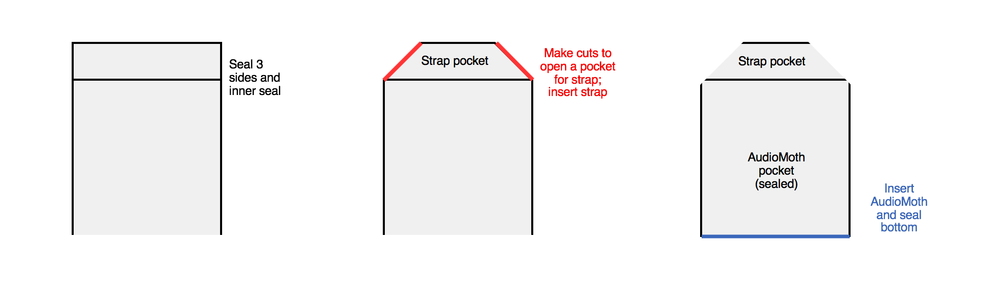

[](https://doi.org/10.5281/zenodo.3667065)

# AudioMoth: a practical guide to the open-source ARU

This guide is intended to be comprehensive for both first-time AudioMoth users and those interested in scaling up their AudioMoth deployment. This guide was originally created in 2019. In 2021, it was updated substantially to reflect the newest firmware available (v.1.5.0). For information about previous firmware versions, see the relevant branch.

The information here complements official guides on the [Open Acoustic Devices website](https://www.openacousticdevices.info/getting-started) and a guide by [David Brown](https://sites.google.com/view/audiomoth/home). Some technical information about the devices themselves is excluded. We have also elaborated on each step by including images, procedures, and rules of thumb that we've created while deploying thousands of AudioMoths.

Please submit suggestions for modifications to this guide via creating pull requests on the GitHub repository, or emailing me at `tessa.rhinehart at pitt.edu`.

#### Table of contents

* [Quick start](#quick-start)
* [Purchase supplies](#supplies)
  * [Purchase AudioMoths](#purchase-audiomoths)
  * [MicroSD cards](#microsd-cards)
  * [Batteries](#batteries)
* [Select your configuration](#configuration)
  * [Recording settings](#recording-settings-tab)
  * [Schedule](#schedule-tab)
  * [Advanced settings](#advanced-settings)
  * [Example configurations](#example-configurations)
  * [How many hours will my AudioMoth record?](#how-many-hours-will-my-audiomoth-record)
* [Recording](#recording)
  * [Apply configuration]
  * [Switch recorder on]
* [Enclosures](#enclosures)
* [Calibration](#calibration)
* [Deployment](#deployment)
  * [Selecting deployment points](#selecting-deployment-points)
  * [Tracking deployment metadata](#tracking-deployment-metadata)
  * [Informing the public](#informing-the-public)
  * [Tips for scaling up](#tips-for-scaling-up)
  * [Playback and imitation](#playback-and-imitation)
* [Data management](#data-management)
  * [Data upload](#data-upload)
  * [Metadata management](#metadata-management)
* [Data analysis](#data-analysis)
* [Citing this guide](#citing-this-guide)
* [Acknowledgements](#acknowledgements)


# Quick start

What, in general, is required to use an AudioMoth? A good general introduction to the AudioMoth is available in the [AudioMoth guide](https://docs.wixstatic.com/ugd/d97703_9ac305905bdd4cdfab6aee99767a56e6.pdf) by Open Acoustic Devices. Here's an example of the steps we take to deploy AudioMoths:

* Assemble supplies
  * [Purchase AudioMoths](#purchase-audiomoths) 
  * Buy necessary supplies, including batteries and SD cards
  * Insert batteries and microSD card into AudioMoth
* Create recording schedule
  * Download the [configuration app](https://www.openacousticdevices.info/applications) to your computer
  * Use the app to create a "program" (a recording schedule for the AudioMoth to follow) as described in detail below, **formatting time in UTC**
  * Connect AudioMoth to computer and press green button on configuration app to set the program
  * Disconnect AudioMoth from computer
* Create or purchase housings for your AudioMoths
* Deploy AudioMoths in the field
  * Devise a field protocol for deployment of the AudioMoths
  * Check on the legal requirements of your deployment, e.g. permissions or "recording in progress" signs
  * Flip switch to "CUSTOM" to start recording on schedule
  * Deploy AudioMoths in housings
* Collect AudioMoth data
  * Pick up AudioMoths and turn them off
  * Download data from microSD cards onto computer

# Supplies

The first step to assembling an AudioMoth is getting the necessary supplies and assembling them to create a working recorder.

## Purchase AudioMoths

There are several ways to purchase AudioMoths. 

Wherever you purchase AudioMoths, make sure you check what version you're purchasing. For instance, AudioMoth v1.0.0 has sharp corners and a protruding switch; v1.1.0 has rounded corners and a recessed switch to reduce bag breakage.

**Option 1: GroupGets**: [GroupGets](https://groupgets.com/manufacturers/open-acoustic-devices/products/audiomoth) group purchases are the main way to purchase the latest version of AudioMoths. These purchases open periodically. Make sure to purchase your AudioMoths far in advance of your study, as these purchases are not always open, and the lead time on manufacturing the AudioMoths can be several months.

**Option 2: LabMaker**: For those who can't wait for the next GroupGets purchase, AudioMoth is available at higher prices on LabMaker. Currently the AudioMoth versions available on LabMaker are [AudioMoth v1.2.0](https://www.labmaker.org/products/audiomoth-v1-2-0) and [AudioMoth v1.1.0](https://www.labmaker.org/products/audiomoth-v1-1-0). LabMaker prices are higher because a smaller number of devices are assembled at once, so there is less of an economy of scale.

**Option 3: large-scale PCB manufacturing**: For some versions of the AudioMoth, it may be possible to get AudioMoths at a lower price and larger volumes if you place a large order directly through a PCB manufacturer.
* The PCB manufacturer will create the AudioMoths based off the schematic you provide. The schematic for older versions of AudioMoths (1.0.0 and 1.1.0) has been released publicly. The version 1.2.0 schematic has not been released, so this version cannot currently be purchased through this method. 
* Our lab has had excellent experiences purchasing from [RushPCB](https://rushpcb.com/). We bought the devices pre-assembled (i.e., components connected to boards, battery pack soldiered to board), but without the firmware flashed. We found it easy to flash the firmware in our lab.
* Parts of the original AudioMoth design are constantly going out of stock due to high demand. We enlisted the help of our school's electronics shop to find new parts that were interchangeable with the out-of-stock parts and replace these in the schematic.

## MicroSD cards

The AudioMoth saves recordings on a microSD card. 

### Choosing a card

Your card choice will primarily depend on the frequency at which you plan to record.

For recording at sample rates of 48 kHz and below, we typically use SanDisk Ultra 64GB microSD cards. We have found that if using a 64GB card and recording at a 32 kHz sample rate, AudioMoths' storage and battery life run out at approximately the same time.

For recording at sample rates above 48 kHz, we use SanDisk Extreme 128GB microSD cards. These sample rates require SD cards with fast read/write speeds. Files produced with high sampling rate are also larger, so they use up space on the SD card more quickly.  

For more details on microSD card selection, see the Open Acoustic Devices [SD card guide](https://www.openacousticdevices.info/sd-card-guide) for more information.

### Card formatting

Out of the box, microSD cards are typically supplied with one of two file systems: exFAT (for cards larger than 32GB) and FAT32 (for cards 32GB and less). AudioMoth firmware versions 1.2.2 and after can handle either of these formats. However, firmware versions 1.2.2 and before only support FAT32 cards. 

If you wish to use an AudioMoth firmware version before 1.2.2, you must reformat your cards to the FAT32 file system. Windows computers cannot natively format cards larger than 32GB to the FAT32 format, but there are [free programs](http://ridgecrop.co.uk/index.htm?guiformat.htm) that allow Windows users to format larger cards. Mac computers can format cards at least up to 128GB; we haven't tested anything larger.

### Card usage

Insert the card into the AudioMoth with the contacts facing **up**, as shown on the graphic on the front of the AudioMoth. (It won't fit any other way.)


When an SD card fills, the unit will stop saving recordings to it, and the unit's red LED light will stay constantly lit until the SD card is removed.

When reusing a microSD card that has already been deployed, check to make sure that the card is truly empty before reuse.
* On Mac computers, you can check the amount of space remaining on the card using Disk Utility. Deleting files on the microSD card using the graphical user interface does not actually delete them until the trash bin is emptied!
* You can be certain a card is empty by reformatting the card every time you reuse it, or using the `rm` command in the terminal.


## Batteries

### Choosing batteries
The battery life depends on the type of battery you use. Check the battery's *capacity* in milliamp-hours (mAh). 
* Lithium AA batteries have a larger capacity than typical alkaline AA batteries, but also cost more. 
* On the AudioMoth, the batteries are connected in series, so their capacities do not add up: the capacity of the three batteries connected in series is equal to the capacity of any single battery.

### Increasing battery life
With some electronics expertise you can connect different batteries to the device to increase its battery life. 
* The modified bank of batteries should have a higher *capacity* while maintaining the same *voltage*. For instance, 3 D batteries have the same voltage as 3 AA batteries, but have a higher capacity, so will last longer.
* The *voltage* of batteries connected in series (as they are on the AudioMoth) is equal to the number of batteries multiplied by the voltage of each battery. AudioMoth v1.0 uses 3 batteries at 1.5 volts each, so the voltage of the battery bank is `3 * 1.5V = 4.5V`.
* The *capacity* of batteries in series is the capacity of any one battery in the series. (Don't mix batteries of different capacities, or new and old batteries.) For instance, a Duracell alkaline AA battery has a capacity of 2850mAh.

### Battery usage
Because the AudioMoth doesn’t have an onboard battery, the set time will be lost if the battery falls out. On AudioMoth firmwares before 1.5.0, the recording schedule will also be lost as well. 
* Masking tape is a cheap, mostly secure way of preventing batteries from falling out
* We take care not to jostle AudioMoths in transport, and we always bring several extra programmed AudioMoths with us during deployments, just in case we drop one and the batteries fall out. 
* While deploying recorders in CUSTOM mode, it will be obvious if a device has lost its programming; its red and green lights will blink simultaneously when you try to flip the switch to CUSTOM.


# Create a configuration

Before using the AudioMoth, you will typically want to create a custom recording configuration. Depending on your needs, you may customize the time of day during which recordings are made, the length of each recording, the amount of time the recorder "sleeps" between each recording, and more. (But see the information about the [default mode](#default) below, which causes the AudioMoth to start recording immediately).

In general, AudioMoths that are recording according to a configuration cycle through recording/sleeping phases within "recording periods" that you have already configured. For instance, you could set the AudioMoth to record a minute-long file every 10 minutes for the first 6 hours after sunset. 

Use the [Audiomoth configuration app](https://www.openacousticdevices.info/applications) to create a custom recording schedule for your AudioMoth.  
The latest version of the configuration app has three tabs to control different aspects of the recorder configurations: Recording Settings, Schedule, and Advanced Settings. 

For a simple and intuitive graphical introduction to this process, see the [Open Acoustic Devices Config App Guide](https://www.openacousticdevices.info/config-app-guide). The description below includes a few additional details.

## "Recording settings" tab
This tab controls the sample rate of recordings, the gain to be used on the microphone, the length and space between recordings, and a few other settings.

### Sample rate
Set sample rate as 2x the highest frequency you want to record.

* **What sample rate should I use?** You should use a sample rate that is 2x higher than the highest frequency you want to record. This sample rate is known as the [Nyquist rate](https://en.wikipedia.org/wiki/Nyquist_rate) and is the minimum sample rate required to resolve a sound at a particular frequency. For birds, a 32kHz sample rate is fine. For bats' ultrasonic calls, a much higher sample rate is required.

* Sample rates > 192kHz are "experimental"--use with caution.

* Recording at high sample rates requires faster SD cards and takes up more storage space. See the section on [SD cards](#sd-cards-and-batteries) for more information. 

* What is a sample rate, anyway? A microphone captures audio by transforming the sound waves into voltage. Digital audio is recorded by sampling that voltage. The *sample rate* in Hertz is the number of times per second the voltage is sampled. For a helpful introduction to digital audio, check out [this guide](https://web.archive.org/web/20190201094638/https://docs.cycling74.com/max5/tutorials/msp-tut/mspdigitalaudio.html)


## "Schedule" tab 

### Recording periods
The "schedule" tab lets you set 1-4 recording period(s) in Coordinated Universal Time (UTC) using a 24-hour clock.

# WARNING: RECORDING SCHEDULES MUST BE CREATED IN UTC, NOT YOUR OWN TIMEZONE! (see below)

TODO: update this to describe how to use the time zone features (and when to use them, and whether they apply to recording names as well) ^ 

Hopefully this warning will catch the eye of anyone quickly skimming this guide. This is one of the biggest and most commonly encountered silent failure points of using an AudioMoth. 

Follow the instructions in the next section carefully, or else you may program your AudioMoths to record at the wrong time. It's disappointing to bring your recorders back from 2 months of deployment and realize your "dawn chorus" recordings were actually taken at midnight.


* **What is UTC?**: Instead of referring to a time zone (like Eastern Time, Pacific Time, etc.), recordings on the AudioMoth are scheduled in UTC, a universal time standard. This is done to avoid ambiguity in time zones. UTC is equivalent to Greenwich Mean Time (GMT), but does not observe Daylight Savings time as some countries in the GMT time zone do.

* Make sure to press "Add recording period" after typing in the desired time of each recording period. Recording periods will show up on the red/white graphic or the period listing on the right side of the program. Likewise, be sure to remove unwanted periods.

* The recording periods will only be adhered to when the AudioMoth is on CUSTOM mode. On DEFAULT mode, the recorder begins recording immediately, without regard to any scheduled recording periods. 


### Gain
The gain is the amount that sounds from the microphone will be amplified once recorded. Selecting the optimal gain requires trial and error in your particular field conditions. If the gain is too high, your recordings will [clip](https://en.wikipedia.org/wiki/Clipping_(audio)), creating an unpleasant distortion that can be challenging, if not impossible, to analyze. Alternatively, if the gain is too low, sounds will be faint and hard to hear.

### Sleep-record cycles
In the "schedule" tab you select the time of day that the AudioMoth should record each day (the "recording period" or periods). However, the AudioMoth doesn't have to record continuously every day. You can use a sleep/record schedule to record only a limited amount of time during the scheduled recording period.


* When this feature is enabled, the recorder will create a recording for the number of seconds indicated in "recording duration" and then sleep for the number of seconds indicated in "sleep duration."

* If you do not wish to enable this feature, unclick "Enable sleep/record cyclic recording."
  
* With older versions of the firmware (<1.4.0), to make a single continuous file each recording period, you are not able to disable this feature manually. Instead, you must to set the recording duration length equal to the length of the longest recording period. 
  
* With older versions of the firmware (<1.4.2), you must make sure that your file sizes are less than the WAV file size limit of 4.3GB (4000MB).

* Even if sleep period is set to 0, the device will sleep briefly between recordings to save the prior recording to the card.

### Enable LED
This feature allows you to turn on the LED lights for more information about your AudioMoth, though this might attract more attention from animals/curious humans. Lights are especially useful when testing the recorder. 

LED light meanings are:
* Blinking red = recording
* Blinking green = sleeping between recordings
* Constant red = memory card full
* Both green & red = recording cannot be made. Causes of this include, but are not limited to,

    * time or program not being set (while in CUSTOM mode);
    * the batteries falling out at some point after programming (while in CUSTOM mode);
    * the recorder getting wet; and
    * the SD card malfunctioning or not being formatted correctly.

* Flashing red after turned to USB/OFF: an indicator of battery life (see [official documentation](https://www.openacousticdevices.info/led-guide))


## "Advanced settings" tab
These two features can be used separately, or combined. For more information on these features, see [this document](https://github.com/OpenAcousticDevices/Application-Notes/blob/master/Using_AudioMoth_with_Filtering_and_Amplitude_Threshold_Recording.pdf)

### Filtering
This feature allows you to only record data from a particular frequency band. When you enable filtering, you can choose the following filters. Each allows you to select the frequencies you want to include in the recording. All other frequencies will be filtered out.
* Low-pass: filter out high frequencies
* Band-pass: filter out both high and low frequencies
* High-pass: filter out low frequencies

### Amplitude threshold
This feature allows you to only save samples to the file that meet a particular amplitude threshold. This allows you to save on storage by not saving empty files--especially helpful for high-sampling rate files, which are very large.

This method is primarily intended for animals that call at high frequencies; the high sample rate recordings required to capture these animals' calls take a lot of storage. We would not recommend using this method for animals that call at audible frequencies, where there is a lot of noise that could cause false triggers. Additionally, using triggering limits the applicability of your recordings to other taxa.

## Example configurations

Below are some example configurations created with an older version of the configuration app.

One creates a single 3-hour long recording per day at 32kHz, suitable for recording a bird dawn chorus. 

The other creates minute-long recordings with minute-long breaks in between, 30 each at two different times. The latter program records at a sample rate of 192kHz, perhaps for recording bat ultrasonic sounds, and will require a fast microSD card.


## How many hours will my AudioMoth record?

The number of hours an AudioMoth will record depends on a combination of the capacity of your batteries, the storage size of your microSD card, the sample rate at which you are recording, and whether or not you are using triggered recording.

The AudioMoth Configuration app will calculate the energy and storage used *per day* once you have specified the recording period and recording/sleep durations. This appears at the bottom of the configuration app in every tab. Your recorder will stop recording either when it uses up all of the storage on the microSD card, or when its battery dies: whichever happens first.

* To refresh batteries and cards as infrequently as possible during multi-month deployments, use a battery/SD card combination where the battery life and card storage run out at roughly the same time, given the device's estimated energy and storage usage. For instance, we use Duracell alkaline AA batteries and 64GB microSD cards. At a 32kHz sampling rate, our storage capacity runs out at about the same time that our recorders' batteries die.

* Use [this code](https://trinket.io/python/ff8aeb66e1) to estimate the number of operational days of a battery and SD card. Input card size and capacity of a single battery (e.g., 2850 mAh for a Duracell alkaline AA battery), plus the config app's estimated and storage and energy usage. For more information on battery capacity, see the section on [batteries](#sd-cards-and-batteries).

* With older versions of the firmware (<1.4.2), you must make sure that your file sizes are less than the WAV file size limit of 4.3GB (4000MB). Current versions of the firmware handle file sizes that are approaching this limit by closing the current file and restarting a new one.

* You can extend your recorder's storage space by using triggered recording (see [Advanced settings information](#advanced-settings)).


# Recording

After creating your configuration, you will plug the AudioMoth into your computer, and set the current time and desired recording schedule via the app interface.

## Save and load configuration

TODO: update

Firmware versions 1.4.0 and later save the schedule description to the AudioMoth's microSD card to allow easier recordkeeping. This is saved when recordings are made, not when the AudioMoth itself is programmed.

Additionally, you may save the completed schedule as a file for later reference, reuse, copying, and sharing. Clicking a saved configuration file itself may not correctly open the program. Instead, open the saved program through the configuration app itself. Select the menu option AudioMoth > Open Configuration.


## Apply configuration
On firmware v1.5.0 and beyond, applying the configuration to the AudioMoth once saves the configuration on the AudioMoth even if the batteries are lost. On previous firmware versions, this step did not save the configuration to the microSD card, and it would be lost if the batteries were disconnected. 

* Set switch on AudioMoth to USB/OFF mode.
* Plug into computer via microUSB.
* Verify that the AudioMoth is plugged in: the date, time, and recorder information on the programming app will switch from "grayed out" to black.
* Press green "Configure AudioMoth" button in the programming app. This saves the recording program to the AudioMoth, and sets the AudioMoth's internal clock to your computer's time in UTC.
* The AudioMoth now has a CUSTOM recording schedule. When ready to deploy, move AudioMoth switch to CUSTOM.

TODO: can you load a configuration from the microSD card?

TODO: update this for v 1.5.0; indicate any differences for earlier firmware

TODO: is there an easy way to make sure batteries are correctly connected? / the AudioMoth is correctly programmed? Used to be: * If you switch the AudioMoth to CUSTOM mode and its red and green lights flash simultaneously, this means that the AudioMoth is not able to record. One cause of this is the AudioMoth's batteries falling out. 


## Set the time

The time is automatically set when you set the configuration. However, if the batteries fall out, the time will be lost. There are three ways to set the time without changing the configuration:

### Configuration app

### Time app

### Phone app

## Switch on the recorder

The AudioMoth has a switch on the device for accessing its three modes: USB/OFF, DEFAULT, and CUSTOM.

### USB/OFF
This mode has two purposes.
* USB: When the AudioMoth is plugged into the computer via USB, The switch should also be switched to this mode when plugging the AudioMoth into the computer to apply a recording schedule or update firmware (USB).
* OFF: When not plugged into the computer, the recorder is in a low-power state, but continues to keep time.

### DEFAULT
The DEFAULT mode generally causes the AudioMoth to turn on and start recording immediately. 
* Behavior in DEFAULT mode depends on the firmware version applied to the AudioMoth and whether the AudioMoth has been programmed. 
* Firmware 1.4.2 and after: Record continuously, ignoring sleep/duration settings
  * If AudioMoth has been configured, uses the same sample rate and gain level of the configuration
* Firmware < 1.4.2: Create recordings with sleep interspersed
  * If AudioMoth schedule is configured, uses with the sleep/duration settings of that configuration
  * If AudioMoth schedule is not, record for 10 seconds on, 5 seconds off

### CUSTOM
This is the mode used to record according to the custom configuration.
Note that the switch is fragile and snaps off easily. A slow, careful, and firm touch reduces disappointing switch snapping when turning the AudioMoth on and off. If your switch has snapped, it is possible to [replace the switch slider](https://www.openacousticdevices.info/support/device-support/simple-audiomoth-switch-repair).

The AudioMoth can be turned on in two ways: DEFAULT mode (move switch to the right) or CUSTOM mode (move switch to the left).

* **DEFAULT:** Device immediately starts recording. Recording period/schedule is irrelevant in DEFAULT mode.

  * With firmware versions before 1.4.2, the AudioMoth will take a recording for a desired amount of time, and then will sleep for a desired amount of time. The device repeats this cycle continuously. If the recorder has not been configured with the configuration app, the sleep/record duration settings default to 10 seconds recording - 5 seconds sleeping.

  * Starting in firmware version 1.4.2, DEFAULT mode records continuously, ignoring sleep/duration settings for recording duration time. 

* **CUSTOM:** 

  * If device is turned on outside of the scheduled recording periods, it waits until recording period starts, then begins its recording schedule. 
  
  * If it is turned on during the recording period, it behaves differently based on what firmware is used.
            * With firmware before version 1.4.1, the AudioMoth will not start recording until the next scheduled recording begins. For instance, consider an AudioMoth scheduled to record at 09:00, with a 2-minute recording duration and 2-minute sleep duration. If the AudioMoth was switched to CUSTOM mode at 9:01, it would skip the recording scheduled for 9:00-9:02, and wait until 09:04 to make its first recording.
            * With firmware version 1.4.1 and higher, the recording will be started mid-cycle, rather than waiting for the next cycle to begin.


### Recording troubleshooting

* If a unit's microSD card is full, the unit stops saving recordings. This avoids overwriting previous recordings. In this situation, the unit's red LED light will stay constantly lit until the SD card is removed.

* Turning the AudioMoth off while it is still recording will cause some data loss. This is because the speed at which the data are saved to the AudioMoth lags behind real time. We have found that turning off a recorder while it is recording causes about a 3% loss of data; e.g. a recording that was stopped an hour into the recording will lose 1.8 minutes (60 minutes * 0.03 = 1.8 minutes).

* The first versions of the AudioMoth firmware use filenames with compact representations of the date and time that the recording started. These filenames can be converted to date & time using the instructions in the AudioMoth user manual. In contrast, the "last modified" time represents the time in UTC that the file was saved, i.e., the time in UTC when the recording ended. More recent firmware saves more easily interpreted filenames.


# Apply different firmware to the device

As discussed above, several different firmware versions for the AudioMoth have been created and released. Some releases are just updates, but some have special functionality. For instance, version 1.4.0 enables users to trigger AudioMoth recording only when sound exceeds an amplitude threshold. Behavior of the AudioMoth in different firmware versions differs slightly but meaningfully. To see all of the features added or changed in each version of the firmware, view [the release descriptions in the GitHub repository](https://github.com/OpenAcousticDevices/AudioMoth-Firmware-Basic/releases).

If you want to flash new firmware to your device, download the application [here](https://www.openacousticdevices.info/flashing) and follow its instructions. All of the released firmware versions can be downloaded through the app and applied to the AudioMoth. AudioMoth batteries must be removed before flashing new firmware on the device.


# Enclosures

AudioMoths may break if exposed to water, so it is necessary to house them in a secure, watertight enclosure. This is complicated by the fact that the mic, a MEMS mic, is attached to the circuitboard. The housing must be both watertight and acoustically transparent over the mic.

## Ziploc baggies


AudioMoths can be deployed in Ziploc baggies using [buckling straps (Amazon link)](https://www.amazon.com/Release-Buckle-Black-Adjustable-Luggage/dp/B005DJIBYA). The baggie can be affixed to the strap using zip-ties or by looping the baggie around the strap and securing it with duct tape.

* Trees should be as small as possible; larger trees block sound from arriving in all directions.

* If possible, avoid placing AudioMoths in direct sunlight, as their enclosures may heat up.

The switch and corners of the AudioMoth v1.0 are sharp and can rip through a Ziploc bag. More recent AudioMoth designs have rounded corners and an inset switch to reduce this issue. Take steps to prevent moisture getting into AudioMoth enclosure:

* Don’t transport AudioMoths within the bags, as the bags are more likely to break. Instead, keep the AudioMoth and bag separated until you are ready to hook the bag to the tree. If it is raining, bring an umbrella and transport AudioMoths within a waterproof bag.

* Use freezer bags, not sandwich bags.

* Taping over the sharp parts of the AudioMoth, or judiciously applying hot glue, reduces the chance of punctures. 

    * We do not apply anything next to the mic, as we are currently unsure of the effect on the recording quality. Take care not to obstruct SD card insertion or switch movement.

    * [Example with tape by Jennifer Sheridan](https://twitter.com/JenASheridan/status/1047766465900818432)
   
* Include a desiccant pack in the bag to soak up lingering moisture in the bag, preventing condensation

* Before you walk away from a newly-deployed AudioMoth, inspect the bag for scratches or punctures. Replace if necessary.

## Heat-sealed bags

Ziploc baggies are susceptible to puncture. These baggies can also be challenging to affix to straps. An alternative to Ziploc baggies is creating an enclosure using a heat-sealed bag. We create these using vacuum sealer with a "heat-seal-only" function. (Vacuuming air out of bags would reduce sound quality.)


You can use the following steps to create, deploy, and reuse a heat-sealed enclosure:
* Create seals on 3 sides of the bag
* Seal 2 inches below one of the sealed sides, then cut the corners off of this side. This creates a pocket for your strap to go through.
* Insert strap in pocket
* Program AudioMoth and turn it on
* Insert AudioMoth and any other desired components (e.g. desiccant packet, small notecard about study)
* Seal final edge of enclosure
* Strap enclosure to tree
* After deployment, cut open the bottom of the bag to release the AudioMoth



Two downsides to this method are:

* If you prepare the enclosures on a carpeted surface, you may encounter static shock. To prevent this, you can spray anti-static spray (like hairspray or [anti-static fabric spray](https://www.amazon.com/Static-Guard-Fabric-Spray-Ounce/dp/B0013IRBG4)) on the inside of the bag, or perhaps even rub a dryer sheet on the inside of the bag

* The AudioMoth needs to be programmed and turned on before you put it in the bag. Newer versions of AudioMoth firmware allow you to set a delayed start date for recording; without this, your AudioMoths will start recording on their daily schedule after being turned on, whether or not you've placed them in the field!


## Hard cases

Ziploc baggies do not provide protection against intrusions like rodent chewing and rubbing by deer or bison. If these are a problem in your deployment area, consider using hard enclosures for your AudioMoths.

Hard plastic or acrylic cases should have a hole through which sound can enter. This sound can be covered with a water-resistant acoustic membrane sticker or cloth.

Open Acoustic Devices provides a design for a laser-cut acrylic housing [here](https://www.openacousticdevices.info/single-post/2019/04/24/AA-acrylic-laser-cut-enclosure). OAD has also started selling injection-molded cases through [GroupGets campaigns](https://groupgets.com/campaigns/775-the-official-audiomoth-ipx7-waterproof-case?archived=true&page=1).

In addition, many groups have shared their housing advice on the [WildLabs Acoustic Monitoring forum](https://www.wildlabs.net/community/group/acoustic-monitoring) and Twitter. Some examples:

* [Tupperware case by Emily Hoffman](https://twitter.com/em_hoffmann/status/1200221472641282048)

* [Tupperware case by Carolina Ocampo](https://twitter.com/CarOcampoA/status/1045013308900868096)

* [Hand-assembled case by Heather Wood](https://www.wildlabs.net/community/thread/554)

* [3D printable case by Robin Jones](https://www.thingiverse.com/thing:3292311)

* [3D printable case by Jon Flanders](https://twitter.com/jonrflanders/status/1084491613068513282) (design not released yet)

* [Hand-assembled case by Ruby Lee](https://www.wildlabs.net/resources/case-studies/trialing-audiomoth-detect-hidden-threats-under-canopies-belize) (design not released; scroll down to see picture)

# Calibration

TODO: add information
* Sam's guide
* Importance of calibration
* Oversampling/changes throughout firmware

# Deployment

"Deployment" is the process of putting recorders out into the field. Below are ideas and important notes to remember about deployments including how to inform the public, record data, safely affix AudioMoths to trees, and more.

## Selecting deployment points

### Pre-selecting locations
You can use tools like ArcGIS and Google Maps to pre-identify potential locations at which to place your recorders. Lauren Schricker ([website](https://mountainlauren.weebly.com/) - [Twitter](https://twitter.com/mountain_laur)) developed this method of pre-positioning locations of recorders for deployments:

* Log in to your Google account.
* Create a new map: go to https://drive.google.com > New > More > Google My Maps
* Change the base map to "Satellite"
* Click on the "Add Marker" tool and add markers to your map. You might try to target specific locations, for example, identify particular trees that are good candidates for hanging AudioMoths.
    * We name all of our recorder locations with an alphanumeric code that gives the site of the deployments, and a numeric code that uniquely identifies the point at that site. For instance, our deployments at Powdermill Nature Reserve in the pond area are named PNRE-POND-0001, PNRE-POND-0002, etc. 
* Use the "measuring" tool to find even spacing between points (press "Enter" to temporarily save a measurement before you plot your next point)
* If multiple groups of people will deploy recorders, decide beforehand which group will deploy at which points. You can change the color of the point marker on Google Maps to easily see the group divisions.


### Recorder positioning
Some things to keep in mind when positioning recorders in the field:

* If putting on a tree: tree size affects recording quality. In general, you want a tree that is not huge, but is study enough that the AudioMoth won't be jostled by wind.
* You may want to camouflage your recorders. Black straps stand out against trees. If you are putting your recorders in an area that people walk around in, try to position them so they can't be seen from nearby roads or trails.


## Tracking deployment metadata

During deployments you must capture information about AudioMoths' identity and location, like deployment date, information about the identity (ID number) of the AudioMoth/SD card, the point at which the recorder is deployed, and any important notes about placement such as recorder direction, whether the recorder is hidden by trees, etc.

Detailed protocols help speed up the process and keep track of repetitive tasks. The process of checking steps off a list or filling out a form reduces errors like forgetting to turn the AudioMoth on, checking the recorder is positioned appropriately, making sure to write down the correct ID of the AudioMoth and the point it is at, and so on.

### Written protocols

The "low-tech" way of keeping track of deployment metadata is using printable protocols, then adding this information to a spreadsheet. Here are some example protocols that we use:

TODO: update these?

* [Packing for a deployment](https://github.com/rhine3/audiomoth-guide/blob/master/documents/packing-list.md)
* [Deploying recorders](https://github.com/rhine3/audiomoth-guide/blob/master/documents/deployment-protocol.pdf)
* [Bringing recorders home](https://github.com/rhine3/audiomoth-guide/blob/master/documents/return-protocol.pdf)
* [Post-field checklist](https://github.com/rhine3/audiomoth-guide/blob/master/documents/post-field-checklist.md) (which references the document below)
* [Template for protocols to check in data written down in the field](https://github.com/rhine3/audiomoth-guide/blob/master/documents/post-field-protocol-template.pdf) 
* [Example modification of the above template](https://github.com/rhine3/audiomoth-guide/blob/master/documents/post-field-protocol-example.pdf)

TODO: add spreadsheet link and information

TODO: Tips for using this method: 
* When writing down data in the field, use waterproof paper and permanent pens (e.g., fine-tipped Sharpies or Rite in the Rain brand pens).

### Electronic protocols

TODO: add information about Rainforest Connection app

Some researchers use apps such as [Survey123](https://survey123.arcgis.com/) or [Fulcrum](https://apps.apple.com/us/app/fulcrum-mobile-data-collector/id467758260) to record these data in the field.

TODO: Tips for using this method:

## Informing the public

Because acoustic recording could be considered an invasion of privacy, be careful to check local regulations to determine what you have to do to put recorders on your land. For instance, you may have to acquire permits to perform research on the land. 

To legally deploy recording devices on public lands in the United States, you must make a good-faith effort to inform people that recording is occurring. One way to do this is to place signs at all entry points (especially roads, parking lots) that include the verbiage “By proceeding, you consent to being recorded.” An example of a complete sign:

```
Equipment for recording bird vocalizations is in use in this 
area within 3 hours of sunrise. This equipment may incidentally 
record other sounds, including human conversation. By 
proceeding during this period, you consent to being recorded. 
Please contact Jane Doe at jane.doe@university.edu
with questions about this study.
```

You may wish to add a note on or in each recorder housing briefly describing your study and an email address or phone number that curious people can use to contact you for more information. However, it is unclear whether these notes would deter or encourage recorder loss. :-)


## Tips for scaling up


* Speed matters when you deploy a lot of recorders: for instance, when deploying 100 recorders, an extra 5 minutes spent per recorder results in 8+ additional hours in the field! Practice and refine your deployment protocol before you go to the field.
* Save time in the field by pre-packing bags with desiccant and pre-attaching them to straps in the lab, instead of performing these tasks in the field.
* It is very helpful to have two people in the field.
    * One person can record data, e.g., the unique ID of the AudioMoth, its SD card, and the point at which it is deployed.
    * The other person can manage putting the AudioMoth on the tree and collecting a more accurate GPS point


## Playback and imitation

Your study might require that you use sound playback or imitations. If you're worried about mistaking these sounds for the actual sounds you are trying to record, here are some options:

* Use playback or imitation only outside the hours of the recording
* Keep a record of the days and times you performed imitations, then exclude these recordings from analyses
* Use a distinctive unnatural sound (e.g., a “triple knock” instead of a “double knock”). 
* Verbally announce your presence loudly enough that all recorders that could capture your recording can hear your announcement

Make sure anyone using your data is aware of the protocols you used around playback and imitation. Keep in mind that if you are using automated analysis algorithms, verbal announcements will be missed and unnatural sounds might still be picked up by your algorithm as sounds of interest. 

# Data management

## Data upload


Transferring audio files from hundreds of SD cards is a slow process to do manually. Instead, use a multi-port SD card reader. The photo above shows a network-attached storage device (NAS) with 48 TB of storage, plus a multi-port SD card reader.

* We designed a 32-port SD card reader that can be made using supplies purchased from Amazon, the ["hexadecapus"](https://github.com/kitzeslab/sd-transfer/blob/master/Hexadecapus/Hexadecapus%20multi-SD%20reader.pdf). 

* Each SD card has its number (e.g. 0526) written on the front of the card in Sharpie, but is also given a volume name (e.g., MSD-0526) when it is first reformatted to FAT32. These names are then used to organize the audio files copied off of each card.

* When microSD cards are all named in this way, the following `rsync` command automatically copies data: 

   `rsync -rhv /Volumes/MSD* --exclude .Spotlight* --exclude .fsevents* --exclude System* /Volumes/seagate/transfer_20200622/`

  * The command will find all cards in `/Volumes` named with the prefix "MSD" 
  
  * These data will be copied to a folder on an external hard drive, `/Volumes/seagate/transfer_20200622`
  
  * This command excludes some system files created by some operating systems
  
  * Use the flag `-n` to run a dry-run of this command first!

* Before you consider your data transfer complete, check to make sure that all of the expected folders have been created and they are of the expected size and number of recordings.

## Metadata management
It is important to keep track of metadata about the files that were created. 

* The AudioMoth stores metadata about the recording in the "Comments" field of the EXIF metadata. This includes recording date/time, sample rate, recording duration, gain setting, battery level, and AudioMoth serial number. For instance, here is an example metadata record automatically generated by an AudioMoth, accessed through `exiftool` (see below)

 ```
File Name                       : 5ACDE3A8.WAV
Directory                       : .
File Size                       : 27 MB
File Modification Date/Time     : 2018:04:11 10:35:00-04:00
File Access Date/Time           : 2018:04:17 11:16:05-04:00
File Inode Change Date/Time     : 2018:04:17 11:17:43-04:00
File Permissions                : rwxrwxrwx
File Type                       : WAV
File Type Extension             : wav
MIME Type                       : audio/x-wav
Encoding                        : Microsoft PCM
Num Channels                    : 1
Sample Rate                     : 48000
Avg Bytes Per Sec               : 96000
Bits Per Sample                 : 16
Comment                         : Recorded at 10:30:00 11/04/2018 (UTC) by AudioMoth 0FE081F80FE081F0 at gain setting 2 while battery state was 3.6V
Duration                        : 0:05:00
 ```

 * EXIF data can be accessed via [`exiftool`](http://owl.phy.queensu.ca/~phil/exiftool/) on Mac, Linux, and Windows. Once it is installed, open a Terminal window and run `exiftool FILENAME.wav`

* If SD cards get mixed up, this information can be used to recover what unit the recording was made on.

* Several metadata standards exist for audio recordings, including [Tethys](https://tethys.sdsu.edu/) and [GUANO](https://guano-md.org/). Recording metadata can be updated to be compliant with these standards using exiftool.


# Data analysis

Data analysis techniques vary from completely automated to completely manual. For instance, some software enables automated identification of species vocalizing in recordings. Other software makes it easier to look at, listen to, and organize recordings. Software may be free or paid. 

See [this list](resources/analysis-software.md) for brief descriptions of different data analysis techniques, and a list of softwares available.


## Citing this guide
If you find this guide helpful, please share it! It is available in both [PDF](https://github.com/rhine3/audiomoth-guide/raw/master/guide.pdf) and [Markdown](https://github.com/rhine3/audiomoth-guide/raw/master/guide.md) formats. 

The guide and the other materials in this repository are licensed under [CC-BY-4.0](https://creativecommons.org/licenses/by/4.0/). Please feel free to use and modify them with attribution. You may cite the guide as follows, replacing the `<>` with the DOI in the image at the top of this document.
```
Rhinehart, Tessa A (2020). AudioMoth: a practical  
guide to the open-source ARU. GitHub repository: 
https://github.com/rhine3/audiomoth-guide. DOI: <>
```

If you modify this document and would like to make a .pdf version, you can use `pandoc` on the command line to compile the PDF version from Markdown: `pandoc guide.md -o guide.pdf --variable urlcolor=cyan`. (You will have to remove the DOI image at the top of the document to do so, as `pandoc` doesn't support this image type.)

## Acknowledgements

The AudioMoth was developed by [Open Acoustic Devices](https://www.openacousticdevices.info/). Its first description in academic literature can be found in:

```
Hill, Andrew P., Peter Prince, Evelyn Piña Covarrubias, and 
C. Patrick Doncaster. “AudioMoth: Evaluation of a Smart Open 
Acoustic Device for Monitoring Biodiversity and the Environment.” 
Methods in Ecology and Evolution, December 3, 2017.
```

Thank you to Alex Rogers, Sam Lapp, Trieste Devlin, Lauren Chronister, Lauren Schricker, Abram Fleishman, and other members of the AudioMoth and bioacoustics community who have contributed to this guide. 
