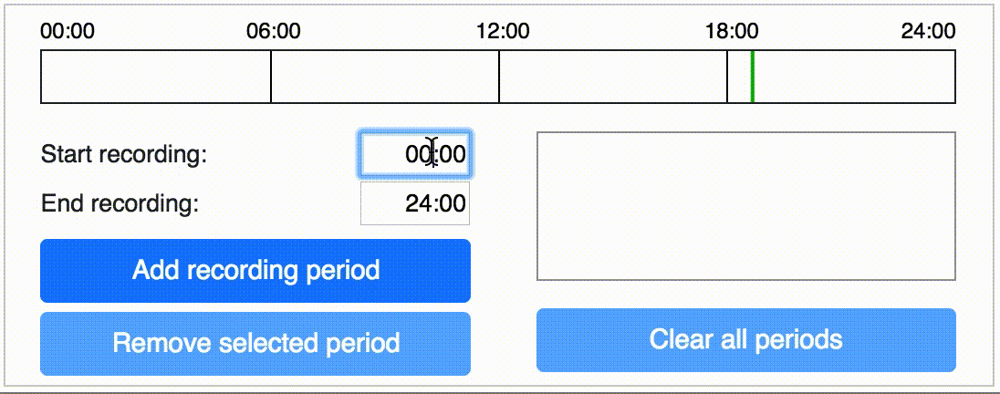
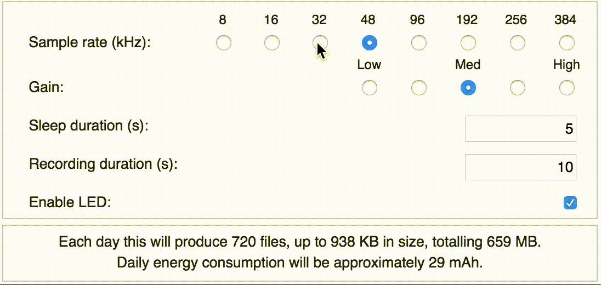
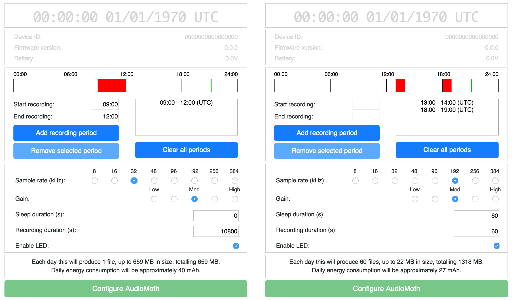
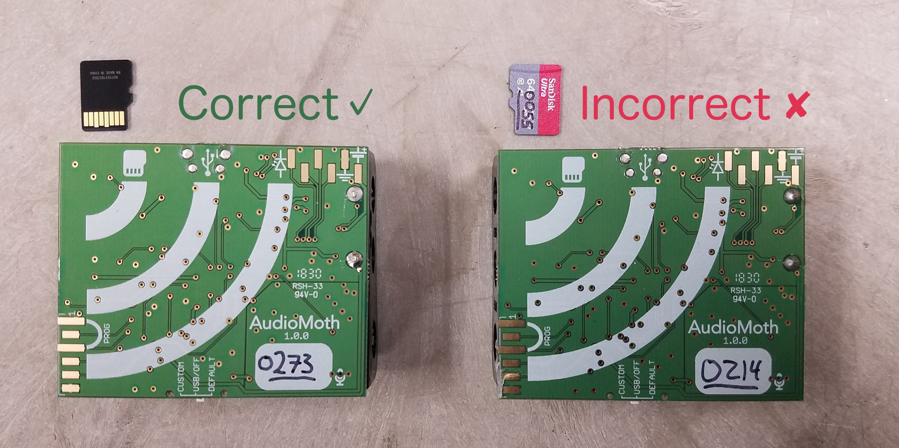
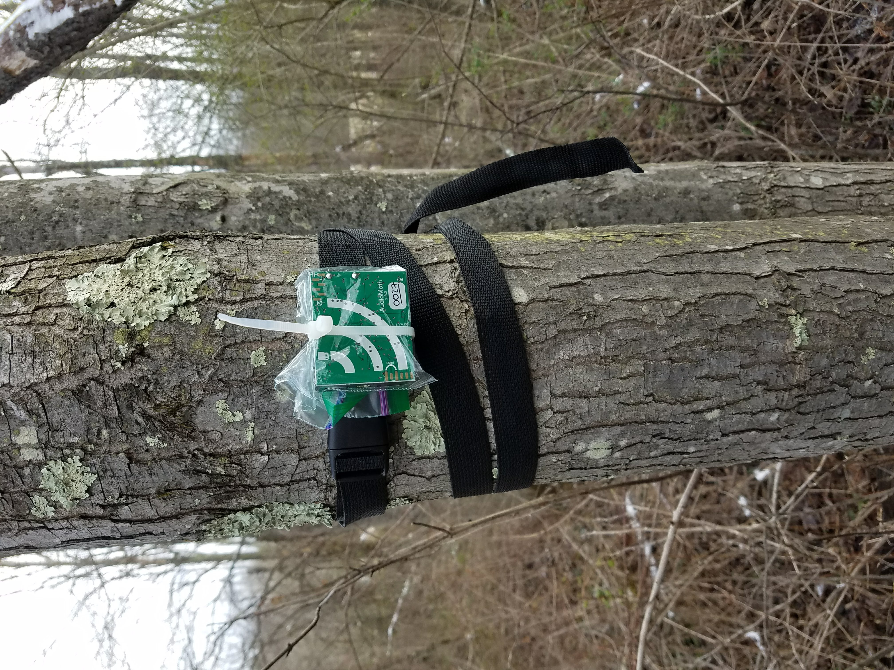
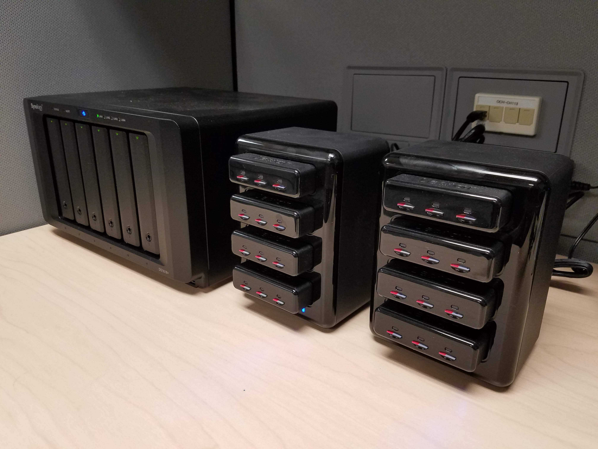

[](https://doi.org/10.5281/zenodo.3667065)

# AudioMoth: a practical guide to the open-source ARU

This guide is intended to be comprehensive for both first-time AudioMoth users and those interested in scaling up their AudioMoth deployment. 

The information here complements official guides on the [Open Acoustic Devices website](https://www.openacousticdevices.info/getting-started) and a guide by [David Brown](https://sites.google.com/view/audiomoth/home). Some technical information about the devices themselves is excluded. We have also elaborated on each step by including images, procedures, and rules of thumb that we've created while deploying hundreds of AudioMoths. 

Please submit suggestions for modifications to this guide via creating pull requests on the GitHub repository, or emailing me at `tessa.rhinehart at pitt.edu`.


#### Cite & share this guide
If you find this guide helpful, please share it! It is available in both [PDF](https://github.com/rhine3/audiomoth-guide/raw/master/guide.pdf) and [Markdown](https://github.com/rhine3/audiomoth-guide/raw/master/guide.md) formats. 

The guide is licensed under [CC-BY-4.0](https://creativecommons.org/licenses/by/4.0/), so please feel free to use and modify it with attribution. It can be cited as the following, replacing the `<>` with the DOI in the image at the top of this document.
```
Rhinehart, Tessa A (2020). AudioMoth: a practical  
guide to the open-source ARU. GitHub repository: 
https://github.com/rhine3/audiomoth-guide. DOI: <>
```

If you modify this document and would like to make a .pdf version, you can use `pandoc` on the command line to compile the PDF version from Markdown: `pandoc guide.md -o guide.pdf --variable urlcolor=cyan`.

#### Acknowledgements

This guide was improved by the experiences and feedback of Alex Rogers, Trieste Devlin, Lauren Chronister, Lauren Schricker, Abram Fleishman, and other members of the AudioMoth community. The AudioMoth was developed by [Open Acoustic Devices](https://www.openacousticdevices.info/). Its first description in academic literature can be found in:

```
Hill, Andrew P., Peter Prince, Evelyn Piña Covarrubias, and 
C. Patrick Doncaster. “AudioMoth: Evaluation of a Smart Open 
Acoustic Device for Monitoring Biodiversity and the Environment.” 
Methods in Ecology and Evolution, December 3, 2017.
```


#### Table of contents

* [Quick start](#quick-start)

* [Programming](#programming)

* [Deployment](#deployment)

* [Scaling up](#scaling-up)

* [Data analysis](#data-analysis)


## Quick start

AudioMoths are very easy to set up out of the box. A good general introduction to the AudioMoth is available in the [AudioMoth guide](https://docs.wixstatic.com/ugd/d97703_9ac305905bdd4cdfab6aee99767a56e6.pdf) by Open Acoustic Devices. Our procedure is as follows.

* [Purchase AudioMoths](#purchasing-audiomoths) 
* Buy necessary supplies, including batteries and SD cards
* [Download](https://www.openacousticdevices.info/applications) the configuration app 
* Use the app to create a "program" (a recording schedule for the AudioMoth to follow) as described in detail below
* Insert batteries and microSD card into AudioMoth
* Connect AudioMoth to computer and press green button on configuration app
* Create housings for your AudioMoths
* Devise a field protocol for deployment of the AudioMoths
* Deploy AudioMoths and put up legally required "recording in progress" signs


## Programming

Before using the AudioMoth, you will "program" it using the [Audiomoth configuration app](https://www.openacousticdevices.info/applications). Depending on your needs, you may customize the time of day during which recordings are made, the length of each recording, and the amount of time the recorder "sleeps" between each recording. The AudioMoth can be used in two modes, which are be accessed using the switch on the device. 

* In DEFAULT mode, the AudioMoth will take a recording for a desired amount of time, and then will sleep for a desired amount of time. The device repeats this cycle continuously.

* In CUSTOM mode, the AudioMoth also cycles through recording/sleeping, but only within "recording periods" that you have already configured. For instance, you could set the AudioMoth to record a minute-long file every 10 minutes for the first 6 hours after sunset. 

* In summary, to make recordings immediately, or make them continuously without regard to the recording schedule programmed on the device, use the DEFAULT mode. When recording at a particular time of day is desired, use the CUSTOM mode. The device behaves differently in several other ways in these different modes, as described in the following sections.

To make a custom recording schedule, or to customize the length of record/sleep periods in DEFAULT mode, use the AudioMoth configuration app. After creating your configuration, you will plug the AudioMoth into your computer, and set the current time and desired recording schedule via the app interface. For a simple and intuitive introduction to this process, see the [Open Acoustic Devices Config App Guide](https://www.openacousticdevices.info/config-app-guide). For more in-depth information, read the steps below.

Note that the switch is fragile and snaps off easily. A slow, careful, and firm touch reduces disappointing switch snapping when turning the AudioMoth on and off. If your switch has snapped, it is possible to [replace the switch slider](https://www.openacousticdevices.info/support/device-support/simple-audiomoth-switch-repair).


### How to create a recording schedule 

Download configuration app: https://www.openacousticdevices.info/applications

Set up to 5 recording period(s) in Coordinated Universal Time (UTC) using 24-hour clock.

   * **What is UTC?**: Instead of referring to a time zone (like Eastern Time, Pacific Time, etc.), recordings on the AudioMoth are scheduled in UTC, a universal time standard. This is done to avoid ambiguity in time zones. UTC is equivalent to Greenwich Mean Time (GMT), but does not observe Daylight Savings time as some countries in the GMT time zone do.
   
   * Make sure to press "Add recording period" after typing in the desired time of each recording period. Recording periods will show up on the red/white graphic or the period listing on the right side of the program. Likewise, be sure to remove unwanted periods.
   


Set recording and sleep duration in seconds. 

* Even if sleep period is set to 0, the device will sleep briefly between recordings to save the prior recording to the card.

* To make a single continuous file each recording period, set the recording duration length equal to the length of the longest recording period. Note that the maximum file size for any single file is 4GB, so make sure that the estimated size of each individual file is less than 4000 MB. 

* The time that recording begins depends on the switch position (DEFAULT or CUSTOM):

    * **DEFAULT:** Device immediately starts recording for recording duration time, then sleeps, then begins recording again. This repeats until DEFAULT mode is turned off or the recorder dies. Recording period/schedule is irrelevant in DEFAULT mode.

    * **CUSTOM:** 

        * If device is turned on outside of the scheduled recording periods, it waits until recording period starts, then begins its recording schedule. 
    
        * If it is turned on during the recording period, it will not start recording until the next scheduled recording begins. 
  
          For instance, consider an AudioMoth scheduled to record at 09:00, with a 2-minute recording duration and 2-minute sleep duration. If the AudioMoth was switched to CUSTOM mode at 9:01, it would skip the recording scheduled for 9:00-9:02, and wait until 09:04 to make its first recording.


The program will calculate the energy and storage used each day once you have specified the recording period and recording/sleep durations.

* To refresh batteries and cards as infrequently as possible during multi-month deployments, use a battery/SD card combination where the battery life and card storage run out at roughly the same time, given the device's estimated energy and storage usage.

* Use [this code](https://trinket.io/python/ff8aeb66e1) to estimate the number of operational days of a battery and SD card. Input card size and capacity of a single battery (e.g., 2850 mAh for a Duracell alkaline AA battery), plus the config app's estimated and storage and energy usage. For more information on battery capacity, see the section on [batteries](#sd-cards-and-batteries).

### Other settings to consider

Set sample rate as 2x the highest frequency you want to record.

* **What sample rate should I use?** You should use a sample rate that is 2x higher than the highest frequency you want to record. This sample rate is known as the [Nyquist rate](https://en.wikipedia.org/wiki/Nyquist_rate) and is the minimum sample rate required to resolve a sound at a particular frequency. For birds, a 32kHz sample rate is fine. For bats' ultrasonic calls, a much higher sample rate is required.

* Sample rates > 192kHz are "experimental"--use with caution.

* Recording at high sample rates requires faster SD cards and takes up more storage space. See the section on [SD cards](#sd-cards-and-batteries) for more information. 

* What is a sample rate, anyway? A microphone captures audio by transforming the sound waves into voltage. Digital audio is recorded by sampling that voltage. The *sample rate* in Hertz is the number of times per second the voltage is sampled. For a helpful introduction to digital audio, check out [this guide](https://web.archive.org/web/20190201094638/https://docs.cycling74.com/max5/tutorials/msp-tut/mspdigitalaudio.html)

Set amount of gain for recording.

* The gain is the amount that sounds from the microphone will be amplified once recorded. 

* Selecting the optimal gain requires trial and error in your particular field conditions. If the gain is too high, your recordings will [clip](https://en.wikipedia.org/wiki/Clipping_(audio)), creating an unpleasant distortion that can be challenging, if not impossible, to analyze. Alternatively, if the gain is too low, sounds will be faint and hard to hear.

Decide whether onboard LED light should be on or off.

* **What do the LED lights mean?**  It can be helpful to turn LED lights on for more information about your AudioMoth, though this might attract more attention from animals/curious humans. Lights are especially useful when testing the recorder. LED light meanings are:
    * Blinking red = recording
    * Blinking green = sleeping between recordings
    * Constant red = memory card full
    * Both green & red = recording cannot be made. Causes of this include, but are not limited to,
    
        * time or program not being set (while in CUSTOM mode);
        * the batteries falling out at some point after programming (while in CUSTOM mode);
        * the recorder getting wet; and
        * the SD card malfunctioning or not being formatted correctly.
        
    * Flashing red after turned to USB/OFF: an indicator of battery life (see [official documentation](https://www.openacousticdevices.info/led-guide))




You may save the completed schedule as a file for later reference, reuse, copying, and sharing.

* Clicking the saved file itself may not correctly open the program. Instead, open the saved program through the configuration app itself. Select the menu option AudioMoth > Open Configuration.


#### Example programs

Below are some example programs. 

One creates a single 3-hour long recording per day at 32kHz, suitable for recording a bird dawn chorus. 

The other creates minute-long recordings with minute-long breaks in between, 30 each at two different times. The latter program records at a sample rate of 192kHz, perhaps for recording bat ultrasonic sounds, and will require a fast microSD card.




### SD cards and batteries

Install formatted microSD card in AudioMoth to be programmed.

* SD cards must be reformatted to MS-DOS (FAT32) prior to each use/reuse. **We have experienced problems if we don't reformat the card every time we reuse it--sometimes, erasing is not enough.** 

* Windows computers can natively format cards less than or equal to 32GB in size, but there are [free programs](http://www.ridgecrop.demon.co.uk/index.htm?guiformat.htm) that allow Windows users to format larger cards. Mac computers can format cards up to 128GB; we haven't tested anything larger.

* Recording with high sampling rate (e.g., recording bats) requires SD cards with fast read/write speeds. Files produced with high sampling rate are also larger, so they use up space on the SD card more quickly. We use SanDisk Extreme 128GB for bat recordings. See the [SD card guide](https://www.openacousticdevices.info/sd-card-guide) for more information.

* When an SD card fills, the unit will stop saving recordings to it, and the unit's red LED light will stay constantly lit until the SD card is removed.

* Insert the card into the AudioMoth with the contacts facing **up**, as shown on the graphic on the front of the AudioMoth. (It won't fit any other way.)




Install batteries.

* Battery life depends on the type of battery you use. Check the battery's *capacity* in milliamp-hours (mAh). Lithium AA batteries have a larger capacity than typical alkaline AA batteries, but also cost more. On the AudioMoth, the capacities do not add up--the capacity of the three batteries connected in series is equal to the capacity of any single battery.

* While the AudioMoth's battery casing accepts 3 AA batteries, with some electronics expertise you can modify the device to increase its battery life. The modified bank of batteries must have the same voltage but a higher capacity in mAh. For instance, 3 D batteries have the same voltage as 3 AA batteries but a higher capacity.

    * The *voltage* of batteries connected in series (as they are on the AudioMoth) is equal to the number of batteries multiplied by the voltage of each battery. AudioMoth v1.0 uses 3 batteries at 1.5 volts each, so the voltage of the battery bank is `3 * 1.5V = 4.5V`.
    
    * The *capacity* of batteries in series is the capacity of any one battery in the series. (Don't mix batteries of different capacities, or new and old batteries.) For instance, a Duracell alkaline AA battery has a capacity of 2850mAh.
   

* Because the AudioMoth doesn’t have an onboard battery, if the batteries fall out, the programming and set time will be lost; if you have programmed a CUSTOM recording schedule it is no longer on the AudioMoth and will require reprogramming. 

    * Masking tape is a cheap, mostly secure way of preventing batteries from falling out
 
    * We take care not to jostle AudioMoths in transport, and we always bring several extra programmed AudioMoths with us during deployments, just in case we drop one and the batteries fall out. 
    
    * While deploying recorders in CUSTOM mode, it will be obvious if a device has lost its programming; its red and green lights will blink simultaneously when you try to flip the switch to CUSTOM.


### Set time and program on AudioMoth

Set switch on AudioMoth to “USB/OFF” mode and plug into computer via microUSB.

Verify that the AudioMoth is plugged in: the date, time, and recorder information on the programming app will switch from "grayed out" to black.

Press green button in the programming app. This saves the recording program to the AudioMoth, and sets the AudioMoth's internal clock to your computer's time in UTC.

The AudioMoth now has a CUSTOM recording schedule. When ready to deploy, move AudioMoth switch to CUSTOM.

Because the AudioMoth doesn’t have an onboard battery, if the batteries fall out, the programming and set time will be lost. **The AudioMoth must be reprogrammed if the batteries fall out.**

* If turned to DEFAULT mode after the batteries come out, the device will record at default settings (10 seconds on, 5 seconds off).

* If turned to CUSTOM mode after the batteries come out, the device **will not record**.


### Flash firmware

Several different firmware versions for the AudioMoth have been created and released. Some releases are just updates, but some have special functionality; for instance, allowing the AudioMoth to trigger recording only when a sound of interest is heard.

If you want to flash new firmware to your device, follow the guide [here](https://www.openacousticdevices.info/flashing).


### Recording results

* If a unit's microSD card is full, the unit stops saving recordings. This avoids overwriting previous recordings. In this situation, the unit's red LED light will stay constantly lit until the SD card is removed.

* Turning the AudioMoth off while it is still recording will cause some data loss. This is because the speed at which the data are saved to the AudioMoth lags behind real time. We have found that turning off a recorder while it is recording causes about a 3% loss of data; e.g. a recording that was stopped an hour into the recording will lose 1.8 minutes (60 minutes * 0.03 = 1.8 minutes).

* The AudioMoth stores metadata about the recording in the "Comments" field of the EXIF metadata. This includes recording date/time, sample rate, recording duration, gain setting, battery level, and AudioMoth serial number. 

   * EXIF data can be accessed via [`exiftool`](http://owl.phy.queensu.ca/~phil/exiftool/) on Mac, Linux, and Windows. Once it is installed, open a Terminal window and run `exiftool FILENAME.wav`

   * If SD cards get mixed up, this information can be used to recover what unit the recording was made on.
   
* The first versions of the AudioMoth firmware use filenames with compact representations of the date and time that the recording started. These filenames can be converted to date & time using the instructions in the AudioMoth user manual. In contrast, the "last modified" time represents the time in UTC that the file was saved, i.e., the time in UTC when the recording ended. More recent firmware saves more easily interpreted filenames.


## Deployment

"Deployment" is the process of putting recorders out into the field. Below are ideas and important notes to remember about deployments, including how to inform the public, record data, safely affix AudioMoths to trees, and more.

### Informing the public

* To legally deploy recording devices on public lands in the United States, you must make a good-faith effort to inform people that recording is occurring

* Place signs on all entry points (especially roads, parking lots). Signs must include the verbiage “By proceeding, you consent to being recorded.” An example of a complete sign:

```
Equipment for recording bird vocalizations is in use in this 
area within 3 hours of sunrise. This equipment may incidentally 
record other sounds, including human conversation. By 
proceeding during this period, you consent to being recorded. 
Please contact Jane Doe at jane.doe@university.edu
with questions about this study.
```

* Another idea is to add a note on each recorder with information about the study. However, it is unclear whether these notes would deter or encourage recorder loss. :-)

### Housings

AudioMoths may break if exposed to water, so it is necessary to house them in a secure, watertight container. This is complicated by the fact that the mic, a MEMS mic, is attached to the circuitboard. The housing must be both watertight and acoustically transparent over the mic.

#### Ziploc baggies



AudioMoths can be deployed in Ziploc baggies using buckling straps.

* If the strap is too small for the circumference of the tree, attach another strap.

* If possible, avoid placing AudioMoths in direct sunlight, as their enclosures may heat up.

The switch and corners of the AudioMoth v1.0 are sharp and can rip through a Ziploc bag. (More recent AudioMoth designs have rounded corners and an inset switch to reduce this issue.) Take steps to prevent moisture getting into AudioMoth enclosure:

* Don’t transport AudioMoths within the bags, as the bags are more likely to break. Instead, keep the AudioMoth and bag separated until you are ready to hook the bag to the tree. If it is raining, bring an umbrella and transport AudioMoths within a waterproof bag.

* Use freezer bags, not sandwich bags.

* Taping over the sharp parts of the AudioMoth, or judiciously applying hot glue, reduces the chance of punctures. 

    * We do not apply anything next to the mic, as we are currently unsure of the effect on the recording quality. Take care not to obstruct SD card insertion or switch movement.

    * [Example with tape by Jennifer Sheridan](https://twitter.com/JenASheridan/status/1047766465900818432)
   

* Include a desiccant pack in the bag to soak up lingering moisture in the bag, preventing condensation

* Before you walk away from a newly-deployed AudioMoth, inspect the bag for scratches or punctures. Replace if necessary.

#### Hard cases

Ziploc baggies do not provide protection against intrusions like chewing by curious rodents, and rubbing by deer or bison. If these are a problem in your area, consider using hard enclosures for your AudioMoths.

Open Acoustic Devices provides a design for a laser-cut acrylic housing [here](https://www.openacousticdevices.info/single-post/2019/04/24/AA-acrylic-laser-cut-enclosure).

In addition, many groups have shared their housing advice on the [WildLabs Acoustic Monitoring forum](https://www.wildlabs.net/community/group/acoustic-monitoring) and Twitter. Some examples:

* [Hand-assembled case by Heather Wood](https://www.wildlabs.net/community/thread/554)

* [3D printable case by Robin Jones](https://www.thingiverse.com/thing:3292311)

* [3D printable case by Jon Flanders](https://twitter.com/jonrflanders/status/1084491613068513282) (design not released yet)

* [Hand-assembled case by Ruby Lee](https://www.wildlabs.net/resources/case-studies/trialing-audiomoth-detect-hidden-threats-under-canopies-belize) (design not released; scroll down to see picture)


### Logistics

* Create a packing list to make sure you have a few essential tools. [Example](https://github.com/rhine3/audiomoth-guide/blob/master/documents/packing-list.md)

* If you’re also using playback or imitation to survey the area, make sure these sounds can’t be mistaken on the recordings for actual birds. For instance:

    * Use playback or imitation only outside the hours of the recording
    
    * Use a distinctive unnatural sound (e.g., a “triple knock” instead of a “double knock”)
    
    * Verbally announce your presence so that all recorders that may capture your recording can hear your announcement
    
* In the case of SD Card mixups, one can use the EXIF metadata ([described above](#recording-results)) to identify which unit created each recording.

## Scaling up

For large deployments, special considerations must be taken into account. For instance, when deploying 100 recorders, an extra 5 minutes spent per recorder results in 8+ additional hours in the field!

### Purchasing AudioMoths

Wherever you purchase AudioMoths, make sure you check what version you're purchasing. For instance, AudioMoth v1.0.0 has sharp corners and a protruding switch; v1.1.0 has rounded corners and a recessed switch to reduce bag breakage.

* [GroupGets](https://groupgets.com/) purchases are run by [Alasdair Davies](https://twitter.com/Al2kA) every few months. These are helpful for folks looking to buy on the scale of a few dozen AudioMoths for $50 each. 

* For those who can't wait for the next GroupGets purchase, AudioMoth is available at higher prices on [LabMaker](https://www.labmaker.org/products/audiomoth). LabMaker prices are higher due to a smaller number of devices being assembled at once. 

* It may be possible to purchase AudioMoths at a lower price if larger volumes are ordered. Our lab has had excellent experiences purchasing from [RushPCB](https://rushpcb.com/). We bought the devices pre-assembled (i.e., components connected to boards, battery pack soldiered to board), but without the firmware flashed. We found it easy to flash the firmware in our lab.

* Parts of the original AudioMoth design are constantly going out of stock due to high demand. We enlisted the help of our school's electronics shop to find new parts that were interchangeable with the out-of-stock parts.


### Pre-select recorder locations

Lauren Schricker ([website](https://mountainlauren.weebly.com/) - [Twitter](https://twitter.com/mountain_laur)) developed this method of pre-positioning locations of recorders for deployments:

* Log in to your Google account.

* Create a new map: go to https://drive.google.com > New > More > Google My Maps

* Change the base map to "Satellite"

* Click on the "Add Marker" tool and add markers to your map. You might try to target specific locations, for example, identify particular trees that are good candidates for hanging AudioMoths.

    * We name all of our recorder locations with an alphabetical code that gives the site of the deployments, and a numeric code that uniquely identifies the point at that site. For instance, our deployments at Powdermill Nature Reserve in the pond area are named PNRE-POND-0001, PNRE-POND-0002, etc. 

* Use the "measuring" tool to find even spacing between points (press "Enter" to temporarily save a measurement before you plot your next point)

* If multiple groups of people will deploy recorders, decide beforehand which group will deploy at which points. You can change the color of the point marker on Google Maps to easily see the group divisions.


#### Access the map data via your GPS unit

* Download the Google My Map in KML format: click the three dots next to the map title > Export to KML/KMZ > click checkbox for "Export to a KML file"

* Download [GPSBabel](https://www.gpsbabel.org/download.html), a free converter you can use to convert KML files to the type of file required by your GPS unit
        
* Select "Google Earth (Keyhole) Markup Language" as the input type, use the file browser to select your file

* Convert the map to the format required by your GPS unit. For instance, Garmin GPS units require a GPX file, so select output format "GPX XML"

* Use the instructions for your device to transfer the map onto your GPS unit (for instance, here are the [instructions for our device](https://www.youtube.com/watch?v=PdPgse1tHdY))

When need to move a point in the field (e.g., the tree you wanted to use fell down), either reset the location of the point or make a new point on your GPS. Make sure to indicate in your field notes whenever the pre-set location of the point was changed. 

* Most commercial GPS units are imprecise, especially under heavy foliage, so it can be challenging to know when you’re at the right point. When in doubt, take notes, and take another GPS point to compare later

* Practice using the crucial features of your GPS unit before you head out to the field, and bring extra batteries

#### Access the map data on your phone via Gaia GPS

* Download the Google My Map in KML format: click the three dots next to the map title > Export to KML/KMZ > click checkbox for "Export to a KML file"

* Download "Gaia GPS" to your phone and create an account.

* Download the KML file on your phone, e.g., by emailing it to yourself.

* If you have an Android phone, open Gaia GPS > click the "plus" with a circle icon in the upper right corner > select "Import file" > find the file on your phone

* If you have an Apple phone, follow [https://help.gaiagps.com/hc/en-us/articles/115003639048-Import-GPX-and-KML-files-in-Gaia-GPS-for-iOS] these instructions.

In the field, keep track of your points by repositioning them as you go. You can also take pictures of the points to help you find them later, and change the color of the pinpoint on Gaia to easily identify the points where you've already deployed recorders.

If multiple people are deploying recorders, it is easiest to give only one person the task of repositioning/photographing/checking off points, as you won't have to combine two maps later. Make sure to bring an external battery charger for your phone.

How to modify Gaia GPS data in the field:

* Click on the point on your map. A small dialogue box will pop up containing the name of the point. 

* Access the details about the point from this small dialogue box:

    * For Android phones, click on the name of the point
    * For Apple phones, click on the "information" icon to the right of the name of the point.
    
* *Reposition points:* From the point details screen, click Edit/Reposition > use your finger to click and drag the point to your current location > click Save

* *Take picture:* From the point details screen, click on the "camera" icon >  accept the picture when you are satisfied with it

* *Change color of waypoint:* This helps to indicate that you have completed the deployment at this spot. From the point details screen, click Edit/Reposition > tap on the current point icon in the upper corner > select a different icon (e.g. a check mark)

* *Rename waypoint:* This is another way to indicate you have completed the deployment at this spot. From the point details screen, click the "pencil" button next to the name of the waypoint.

After you return, export your completed locations. Note that this web-based method does NOT export photos taken at waypoints, but it IS possible to [export photos taken at waypoints on iOS](https://help.gaiagps.com/hc/en-us/articles/115003639728-Export-Tracks-Routes-and-Waypoints-to-GPX-or-KML) (with a 20-photo limit).

* Ensure you are logged into your Gaia GPS account on your phone. Your points should have automatically synced to gaiagps.com. 

* Log in to GaiaGPS.com with your account username and password

* Click on your name in the upper-right hand corner and select "Waypoints"

* Select all of your waypoints to be exported by clicking the checkbox next to each point. To export all points, click the checkbox in the top row next to the word "Title."

    * If you renamed your waypoints, e.g., "New point 35," you can search for and select new points using the search bar with the magnifying glass next to it.
    
* Click "File to Folder" > "Create New Folder" > type in a name for the folder > "Create Folder" > then click on the name of your newly created folder. This adds your points to the folder.

* Click on your name in the upper-right hand corner again and select "Folders"

* Select your folder and then click the "Data" button with a download icon next to it > Download as KML

You can now add your updated points to your original Google Earth map. 

* Open your original map: maps.google.com > Menu icon on the left side > "Your Places" > "Maps" > click your map name > "Open in My Maps"

* Add a new layer for the map: "Add layer" > name layer something descriptive, e.g. "2019 Feb 7th-15th deployment" > under this layer name, click "Import" > select or drag the KML file.


### Logistics


* Save time in the field by pre-pack bags with desiccant and pre-attach them to straps in the lab, instead of performing these tasks in the field.

* It is very helpful to have two people in the field.

    * One person can record data, e.g., the unique ID of the AudioMoth, its SD card, and the point at which it is deployed.

    * The other person can manage putting the AudioMoth on the tree and collecting a more accurate GPS point

* Since so many recorders will be deployed, information about their identity and location has to be taken accurately and efficiently.

    * Record the deployment date; information about the identity (ID number) of the AudioMoth, SD card, and location; any important notes about placement; etc.
    
    * See the previous section about pre-positioning recorder locations and ideas for location naming conventions.
   
* We use protocols to speed up the process and keep track of repetitive tasks. (It's easy to leave out crucial steps, like turning the AudioMoth on, if you don't have to check them each off of a list.)
    
    * [Packing for a deployment](https://github.com/rhine3/audiomoth-guide/blob/master/documents/packing-list.md)
    * [Deploying recorders](https://github.com/rhine3/audiomoth-guide/blob/master/documents/deployment-protocol.pdf)
    * [Bringing recorders home](https://github.com/rhine3/audiomoth-guide/blob/master/documents/return-protocol.pdf)
    * [Post-field checklist](https://github.com/rhine3/audiomoth-guide/blob/master/documents/post-field-checklist.md) (which references the document below)
    * [Template for protocols to check in data written down in the field](https://github.com/rhine3/audiomoth-guide/blob/master/documents/post-field-protocol-template.pdf) 
    * [Example modification of the above template](https://github.com/rhine3/audiomoth-guide/blob/master/documents/post-field-protocol-example.pdf)
 
* When writing down data in the field, use waterproof paper and permanent pens (e.g., fine-tipped Sharpies).




* Transferring audio files from hundreds of SD cards is a slow process to do manually. Instead, we've developed a 48 TB Network Attached Storage (NAS) device with a 24-port microSD card reader (see photo), plus a script to automatically copy audio files from all the SD cards onto the NAS.

  * Each SD card has its number (e.g. 0526) written on the front of the card in Sharpie, but is also given a volume name (e.g., MSD-0526) when it is first reformatted to FAT32. These names are then used to organize the audio files copied off of each card.


## Data analysis

A variety of free and paid acoustic analysis software is available (listed below). Software varies from complete graphical interfaces, to command-line interfaces, to utility libraries that can be used to create analysis pipelines in Python, R, or other programming languages. 

These recommendations are not guarantees of quality of the software or analysis techniques -- this is just meant to be a list of currently used softwares. I have not used them all, and some I haven't found to be useful or accurate for my purposes. You should always judge the performance of an analysis technique based on *your* dataset, as different recording conditions or species distributions can result in starkly different performance.

* **Manual review**: listening to recordings or looking at spectrograms
    * [Audacity](https://www.audacityteam.org/) (free) - simple, lightweight listening and spectrogram viewing and comparison
    * [AviaNZ](http://www.avianz.net/index.php) (free)
    * [Raven Lite](https://ravensoundsoftware.com/software/raven-lite/) (free) - listening and spectrogram viewing; tools to manually select and annotate recordings
    * [WarbleR](https://marce10.github.io/warbleR/) (free) - multipurpose R package
    * [GlassOFire](http://www.oldbird.org/glassofire.htm) (free) - Windows software for nocturnal flight call review and sorting
* **Detection**: locating potential sounds of interest in recordings
    * [AviaNZ](http://www.avianz.net/index.php) (free)
    * [BirdVoxDetect](https://github.com/BirdVox/birdvoxdetect) (free) - machine learning-based detection for nocturnal flight calls
    * [Kaleidescope](https://www.wildlifeacoustics.com/products/kaleidoscope-pro) (paid)
    * [Raven Pro](https://ravensoundsoftware.com/software/raven-pro) (paid) - configurable amplitude triggering-based detection
    * [WarbleR](https://marce10.github.io/warbleR/) (free)
* **Clustering**: grouping sounds into similar-sounding "clusters", which can then be manually annotated
    * [AviaNZ](http://www.avianz.net/index.php) (free)
    * [Kaleidescope](https://www.wildlifeacoustics.com/products/kaleidoscope-pro) (paid)
* **Machine learning-based classification**: using a trained machine learning algorithm to predict the identity of sounds captured in recordings, e.g. identifying bird species in a recording
    * [ARBIMON](https://arbimon.sieve-analytics.com/) - web-based interface for creating own classifiers
    * [BirdNET](https://github.com/kahst/BirdNET) (free) - pre-created classifiers for birds of North America and Europe
    * [BirdVoxClassify](https://github.com/BirdVox/birdvoxclassify) (free) - pre-created nocturnal flight call classifiers for North American species
    * [Kaleidescope](https://www.wildlifeacoustics.com/products/kaleidoscope-pro) (paid) - pre-created bat classification
    * [OpenSoundscape](https://github.com/ktizeslab/opensoundscape) (free, in development) - create own classifiers
* **Measuring acoustic parameters**: soundscape metrics
    * [soundecology](https://cran.r-project.org/web/packages/soundecology/vignettes/intro.html) (free) - calculate soundscape-wide acoustic indices
    * [warbleR](https://marce10.github.io/warbleR/) (free) - measure acoustic signal structure
